## Overview

In this workshop, you'll use <a href="https://www.outsystems.com/low-code-platform/mentor-ai-app-generation" target="_blank">OutSystems Mentor</a> — a <a href="https://success.outsystems.com/documentation/outsystems_developer_cloud/agentic_development/ai_app_generation_in_mentor_web/" target="_blank">GenAI-powered app generator</a> — to transform a functional requirements document into a fully working enterprise web application. By the end, you'll have a complete Inventory Management & Refund Portal with data model, screens, roles, and sample data — all generated in minutes.

## What You'll Learn

- How to create a new web app using Mentor's GenAI capabilities
- How to upload and use a functional requirements document as input
- How to iterate on your app using conversational prompts
- How Mentor generates data models, screens, business logic, and sample data
- How to preview and test your generated application

## Prerequisites

- Complete <a href="/workshops/setting-up/" target="_blank">Setting Up for OutSystems Workshops</a>
- Have ODC Studio installed and connected to your personal environment

---

## Context

Company **ACME Goods** is a retail company that sells products directly to customers. Their operations team needs an internal solution to manage and track product inventory as well as product refunds.

The operations team created a functional requirements document outlining the solution's purpose, main features, data model, roles, and theme. Our goal is to create a solution that equips the operations team to easily track refunds and inventory.

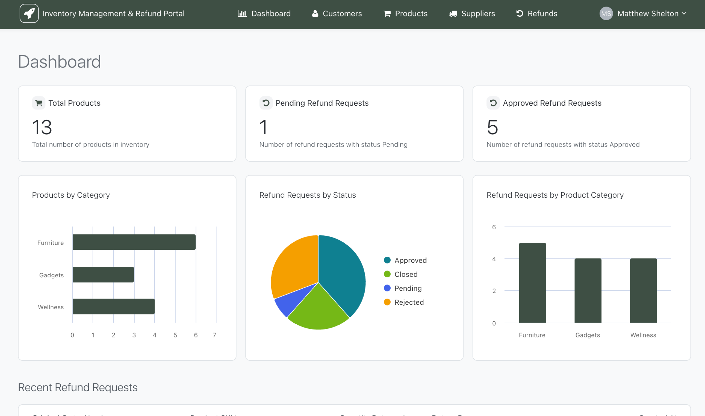

---

## Step 1: Create a New Web Application with Mentor

1. In <a href="https://www.outsystems.com/low-code-platform/developer-cloud" target="_blank">ODC Studio</a>, click **Create**
2. Select **Generate with Mentor**
3. Mentor AppGenerator will open in your browser

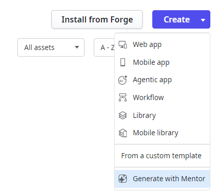

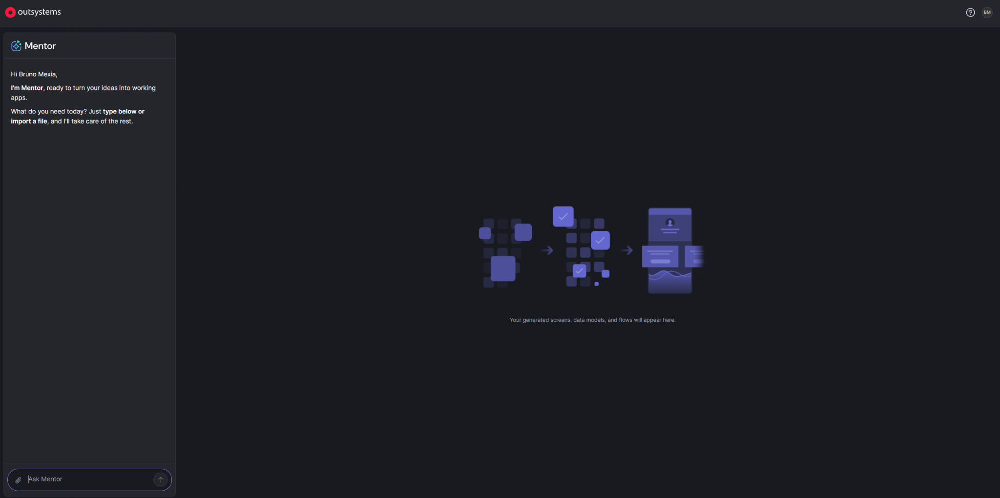

> 💡 **Tip**: You can select Web app, Mobile app, Agentic app, <a href="https://success.outsystems.com/documentation/outsystems_developer_cloud/building_apps/about_business_processes/workflows_in_odc/" target="_blank">Workflow</a> or Library. This allows you to create specific apps based on your requirements with pre-built components and logic.

---

## Step 2: Upload Your Functional Requirements Document

1. In Mentor in your browser, click the **clip symbol** (attachment icon)
2. Select the **"<a href="resources/Inventory%20Management%20&%20Refund%20Portal%20-%20Document.pdf" target="_blank">Inventory Management & Refund Portal - Document.pdf</a>"** from the resources folder
3. Once the document is uploaded, click the **right arrow symbol** or simply hit **Enter**

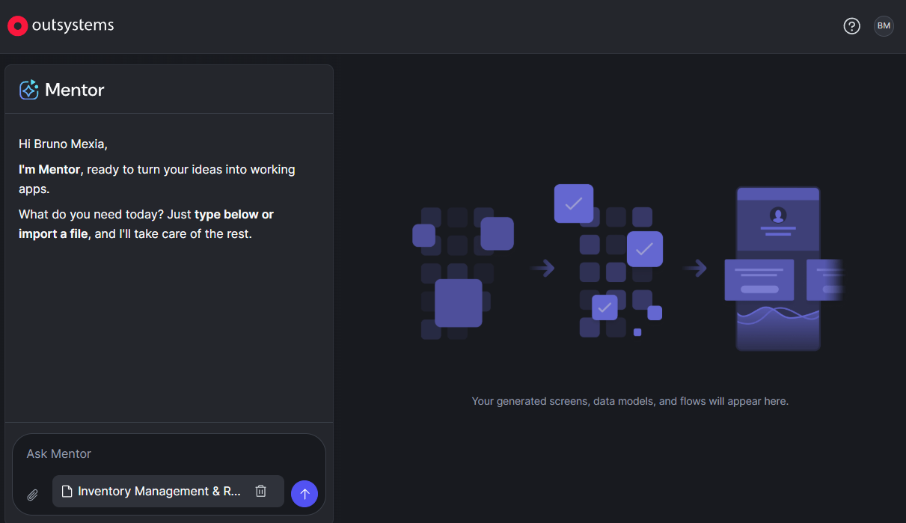

> ℹ️ **Info**: Mentor allows you to use prompts and/or documents to create your web apps. You can also try example prompts based on Mentor best practices.

> 💡 **Tip**: This process takes a couple of minutes. Continue reading the next section while Mentor analyzes the document.

---

## Step 3: Understanding the Functional Requirements Document

The document you uploaded contains the following sections for the Inventory Management & Refund Portal:

- **Purpose** — What the app solves
- **User & Roles** — Who uses it and their permissions
- **Data Model** — Entities and relationships
- **Product Management Workflow** — How products are managed
- **Product Refund Management Workflow** — Refund process
- **Reporting & Analytics** — Dashboard requirements
- **Theme** — Visual styling

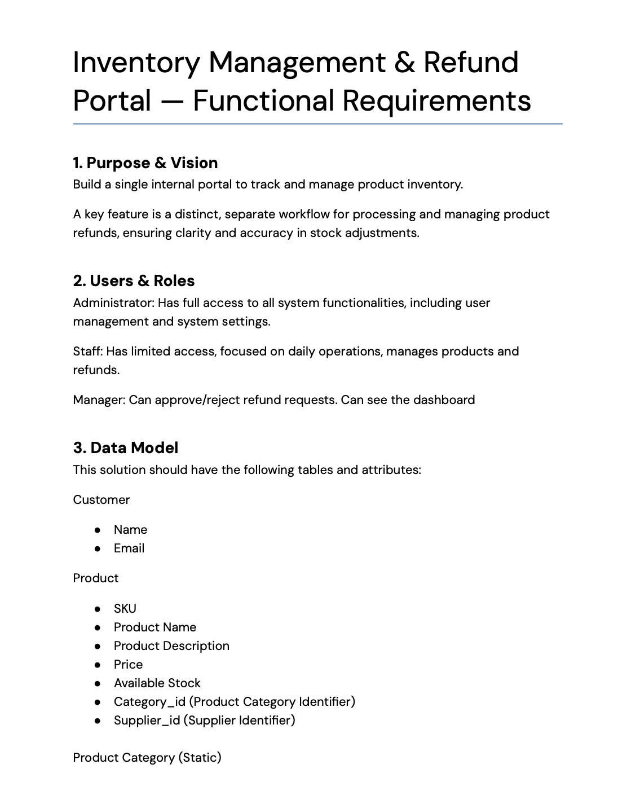

> ℹ️ **Info**: OutSystems allows you to build applications using the full-stack visual language in ODC Studio OR using natural language (prompts/documents) with GenAI in Mentor. In this workshop, we're using the Mentor approach.

---

## Step 4: Review the App Summary

In a few minutes, Mentor will analyze your document to generate a complete blueprint including:

- **<a href="https://success.outsystems.com/documentation/outsystems_developer_cloud/building_apps/data_management/data_modeling/" target="_blank">Data Model</a>** — entities and their attributes
- **Screens** — their content and the entities/roles they use
- **Roles and Permissions** — access control
- **Flows** — business logic

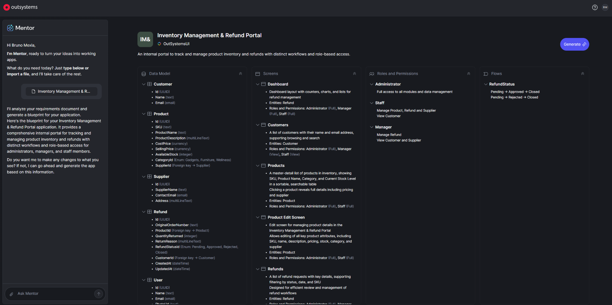

> 💡 **Tip**: Mentor allows you to iterate on and refine every aspect of your application through a seamless conversational experience.

---

## Step 5: Add a New Product Category

Let's use Mentor's conversational capabilities to refine the app:

1. In the conversation text area, type: **"Add a new Product Category: Technology"**
2. Click **send**
3. Wait a few moments and verify that Mentor added this new product category to the blueprint

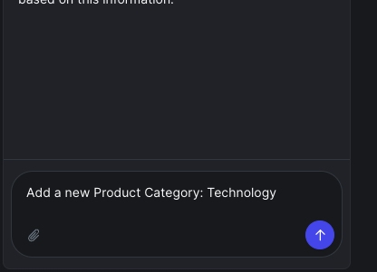

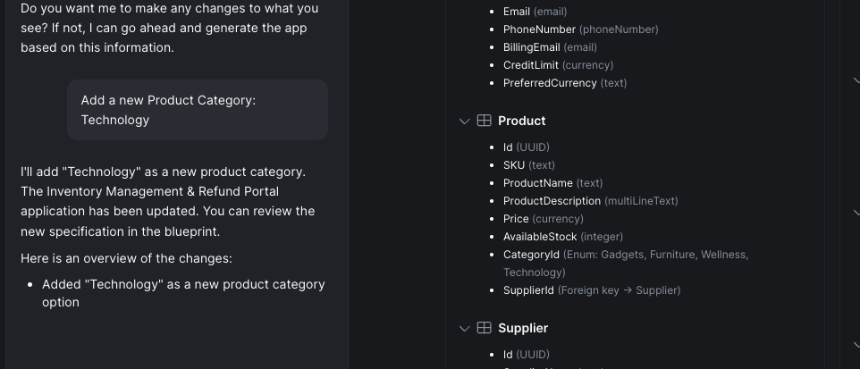

> ✅ **Checkpoint**: You should see "Technology" appear as a new product category in the blueprint.

---

## Step 6: Generate the App

1. Click the **Generate** button to trigger app generation
2. The app generator process will start — this takes a couple of minutes

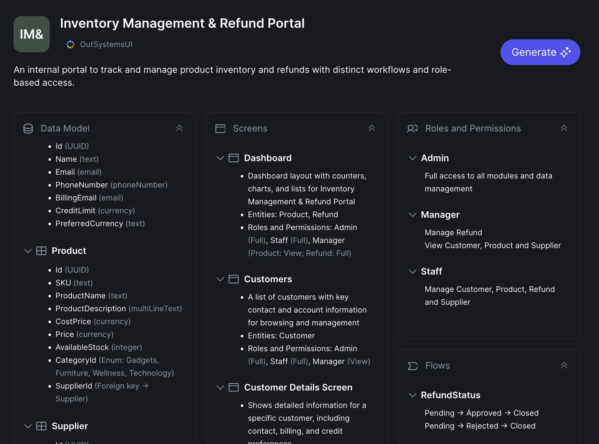

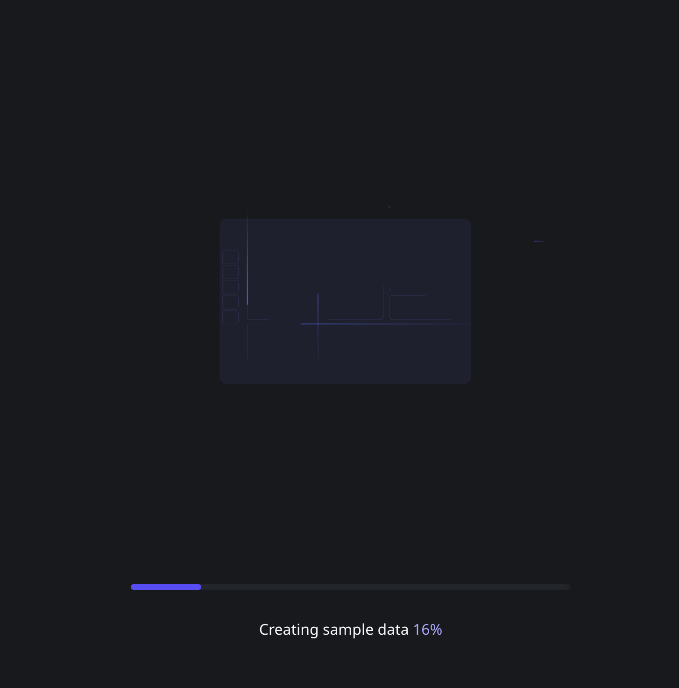

Mentor will generate a complete full-stack application in cloud-native infrastructure:

1. Design and Build Data Model
2. Generate <a href="https://success.outsystems.com/documentation/11/building_apps/data_management/bootstrap_an_entity_using_an_excel_file/" target="_blank">Sample Data</a> & Bootstrap
3. Generate Screens & Styles
4. Generate <a href="https://success.outsystems.com/documentation/11/onboarding_developers/outsystems_main_concepts/" target="_blank">Business Logic</a>

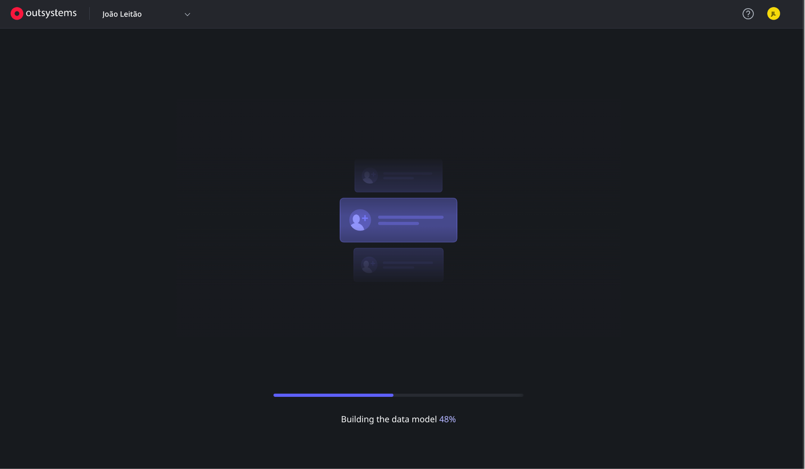

> ⚠️ **Warning**: Generation takes up to 5 minutes. Don't close the browser tab during this process.

---

## Step 7: Review the Generated App

Once generation completes:

1. You should see an overview of your app with screens, data model, and roles
2. In the bottom left corner, click the zoom control to see all screens properly
3. Navigate between the created screens
4. Expand the data model to see attributes and verify against your functional document

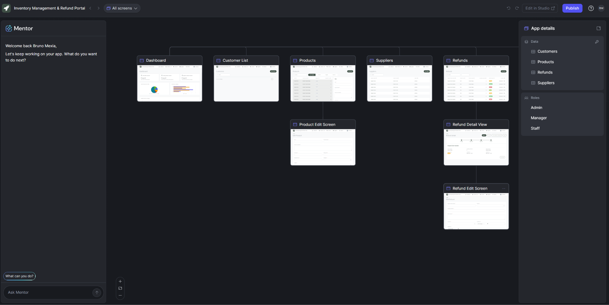

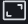

> ℹ️ **Info**: After generation, Mentor allows you to see your app's screens, data model, and roles. You can add or change attributes, roles, etc., always with prompts and concrete suggestions based on your application context.

---

## Step 8: Preview Your App

1. Click the **Preview** button to open the app in your browser

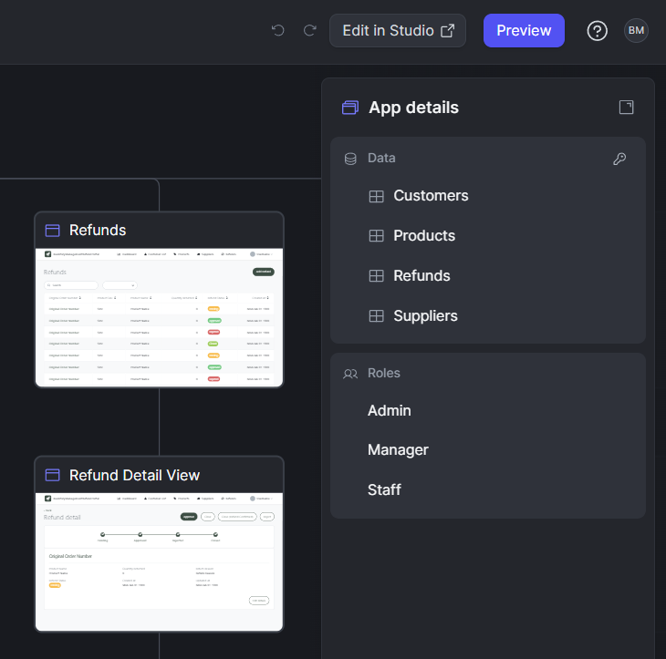

> ⚠️ **Warning**: If you receive an error when publishing, refer to the <a href="/workshops/setting-up/#workarounds" target="_blank">Workaround section</a> for backup instructions.

---

## Step 9: Verify Your Running Application

Your app should now be running with:

- A **Dashboard** screen with analytics
- **Product management** screens
- **Refund management** screens
- **<a href="https://success.outsystems.com/documentation/11/building_apps/data_management/bootstrap_an_entity_using_an_excel_file/" target="_blank">Sample data</a>** auto-generated by Mentor

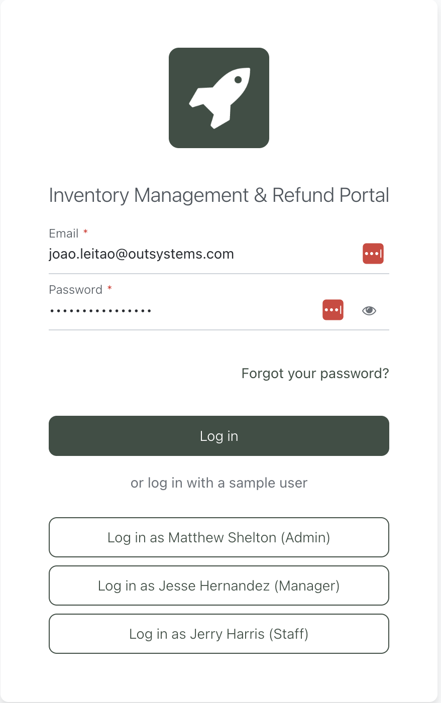

> 💡 **Tip**: Mentor generates sample data to help you test your application. You can also login with sample users according to the defined roles.

> ⚠️ **Warning**: The Dashboard screen can be slightly different from the image. Data can take a moment to appear as you've just published — refresh the page a couple of times if needed. If you don't have sample data, follow the <a href="/workshops/setting-up/#workaround-sample-data-bootstrap" target="_blank">bootstrap workaround steps</a>.

---

## Summary

Congratulations! 🎉 You've successfully transformed a functional requirements document into a complete enterprise web application using <a href="https://success.outsystems.com/documentation/outsystems_developer_cloud/agentic_development/ai_app_generation_in_mentor_web/" target="_blank">GenAI-powered Mentor</a>. In just a few minutes, you generated:

- A complete data model with entities and relationships
- Multiple screens with forms, tables, and dashboards
- User roles and permissions
- Sample data for testing
- <a href="https://success.outsystems.com/documentation/11/onboarding_developers/outsystems_main_concepts/" target="_blank">Business logic</a> and <a href="https://success.outsystems.com/documentation/outsystems_developer_cloud/building_apps/about_business_processes/workflows_in_odc/" target="_blank">workflows</a>

## Next Steps

- Continue to <a href="/workshops/jumpstart-2-bootstrap-orders/" target="_blank">JumpStart 2: Create and Bootstrap Orders</a> to extend your app with ODC Studio
