## Overview

Now that you've created your first web app using Mentor, it's time to extend it using OutSystems' full-stack IDE (<a href="https://www.outsystems.com/low-code-platform/developer-cloud" target="_blank">ODC Studio</a>). You'll create new database entities from Excel files, establish relationships between tables, and use Mentor in Studio to generate order management screens.

## What You'll Learn

- How to import entities from Excel files (bootstrap)
- How to create foreign key relationships between entities
- How to validate your data model using Entity Diagrams
- How to use Mentor in Studio to generate screens via prompts
- How to publish and test your extended application

## Prerequisites

- Complete <a href="/workshops/jumpstart-1-requirements-to-app/" target="_blank">JumpStart 1: From Requirements to an Enterprise Web App</a>

---

## Step 1: Open Your Web App in ODC Studio

1. Go back to **ODC Studio**
2. Search for your app: **"Inventory Management & Refund Portal"** (the name may be slightly different)
3. Click on your app, then click the **Edit** button

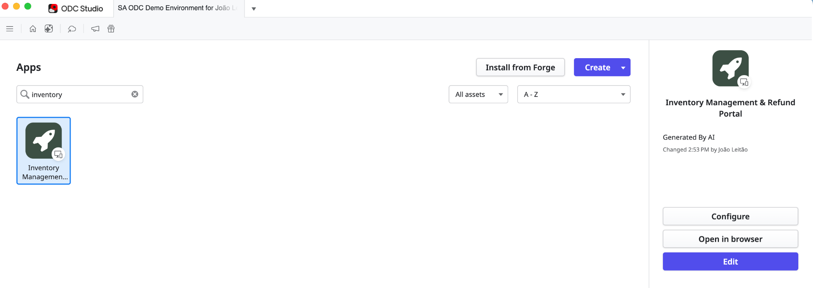

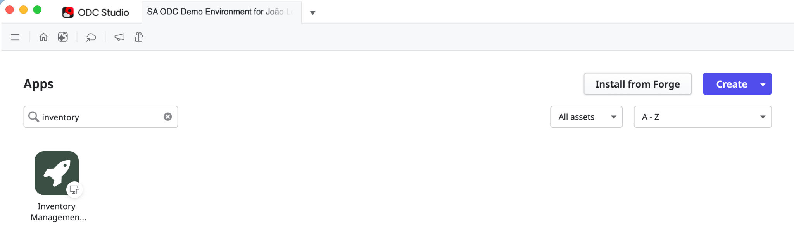

> ℹ️ **Info**: The app you opened was generated by Mentor and deployed to the development stage. What Mentor generates is just the starting point — everything can be adapted, refined, and extended using OutSystems' visual development language.

---

## Step 2: Create the Orders Entity from Excel

1. Go to the **"Data"** tab
2. Right-click on **"Database"**
3. Choose **"Import New Entities from Excel"**
4. Select the **"<a href="resources/Orders.xlsx" target="_blank">Orders.xlsx</a>"** file from the resources folder
5. Click **Import** when prompted for confirmation
6. The **"Order"** entity is automatically created

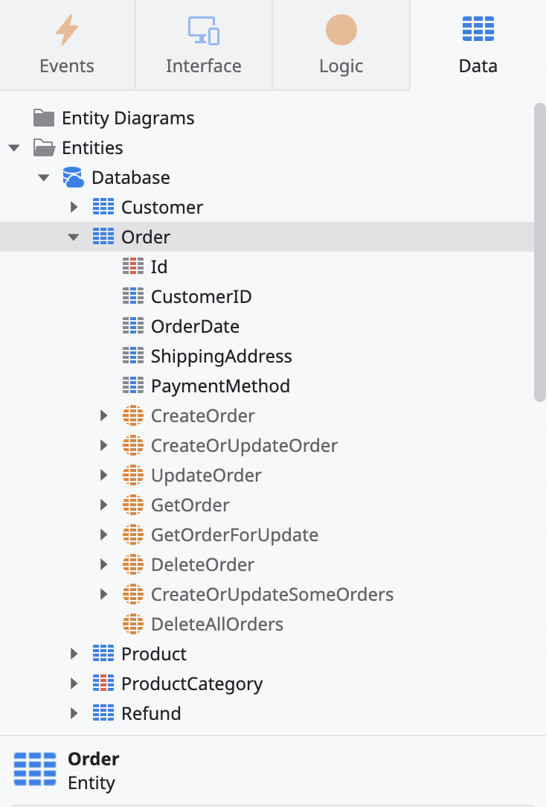

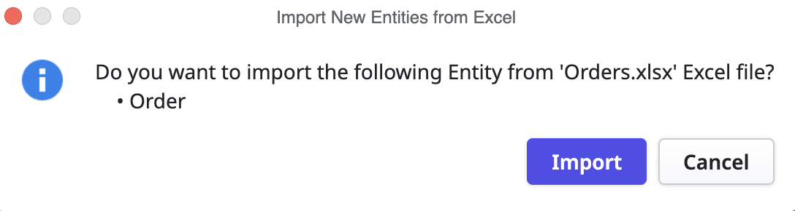

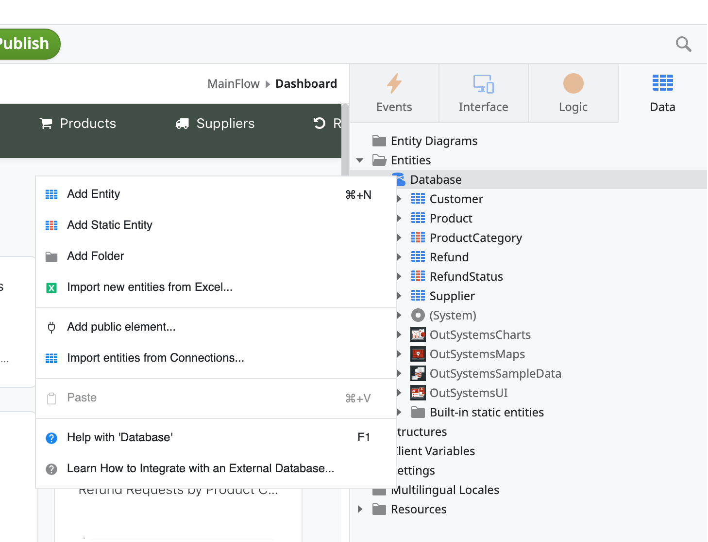

> 💡 **Tip**: This process is called <a href="https://success.outsystems.com/documentation/11/building_apps/data_management/bootstrap_an_entity_using_an_excel_file/" target="_blank">Bootstrap</a> — it creates an entity and populates it with data from Excel in one step. It's one of OutSystems' development accelerators for common tasks.

---

## Step 3: Update the Orders Entity Data Types

1. In the **"Data"** tab, expand the **Order** entity
2. Click on the **Customer_Id** attribute
3. On the bottom right corner, change its Data Type from **Integer** to **Customer Identifier**

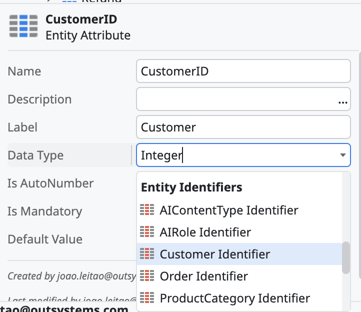

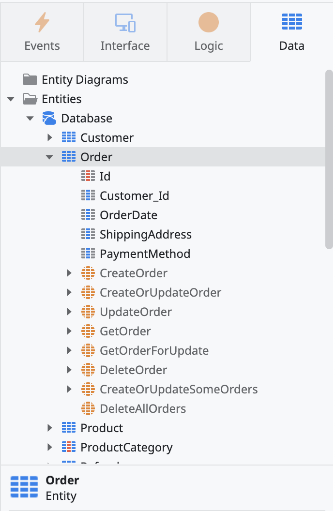

> ℹ️ **Info**: Mapping an entity attribute to an entity identifier creates relationships between entities. The "Customer_Id" attribute defined as a Customer Identifier establishes a foreign key relationship.

---

## Step 4: Create the OrderItem Entity from Excel

1. Go to the **"Data"** tab
2. Right-click on **"Database"**
3. Choose **"Import New Entities from Excel"**
4. Select the **"OrderItem.xlsx"** file
5. Click **Import** when prompted
6. The **"OrderItem"** entity is automatically created

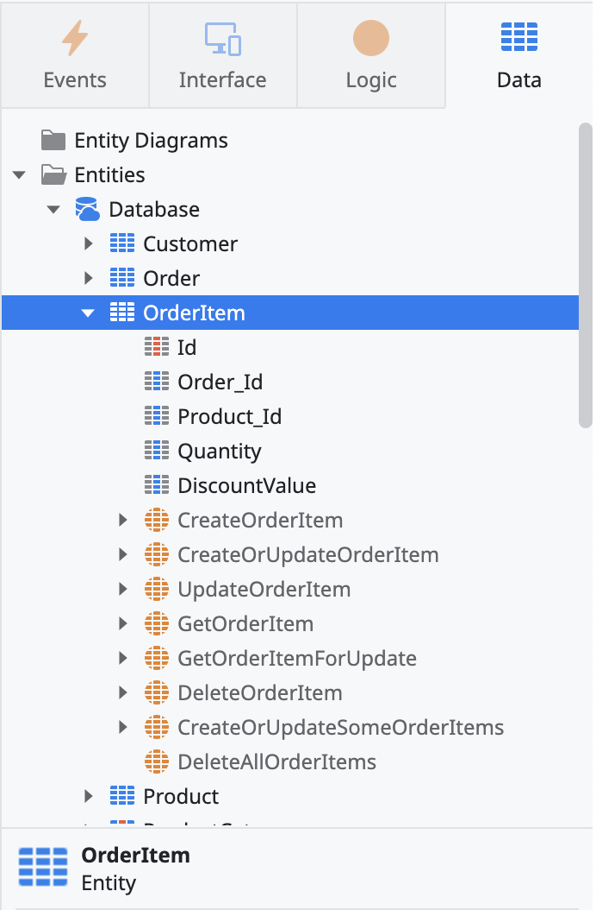

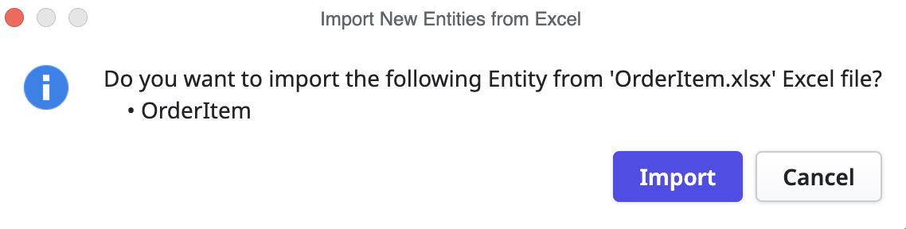

---

## Step 5: Update the OrderItem Entity Data Types

1. In the **"Data"** tab, expand the **OrderItem** entity
2. Click on **Order_Id** attribute → change Data Type to **Order Identifier**
3. Click on **Product_Id** attribute → change Data Type to **Product Identifier**

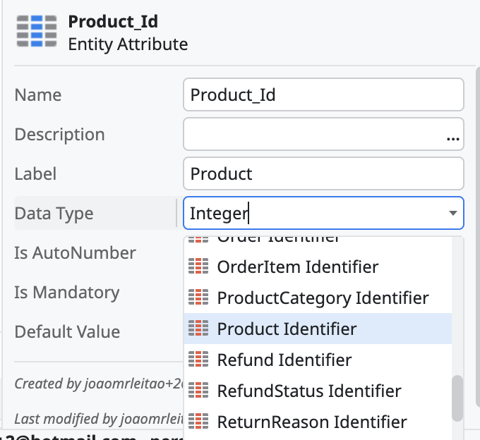

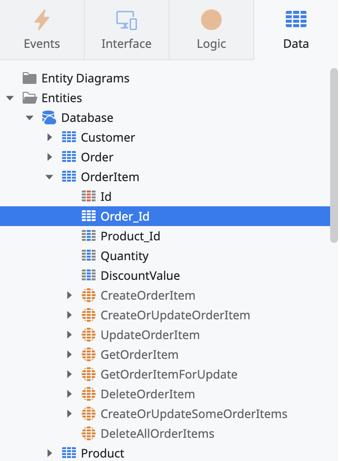

> ✅ **Checkpoint**: Both Order_Id and Product_Id should now show as Identifier types (not Integer).

---

## Step 6: Validate Using an Entity Diagram

1. Go to the **"Data"** tab
2. Under **Entity Diagrams**, right-click and select **"Add Entity Diagram"** — name it **"MyInventoryDiagram"**
3. Double-click on **"MyInventoryDiagram"**
4. Select the entities: Customer, Order, OrderItem, Product, ProductCategory, Refund, RefundStatus, and Supplier
5. Drag and drop all selected entities onto the diagram
6. Validate that the foreign key relationships are correctly shown

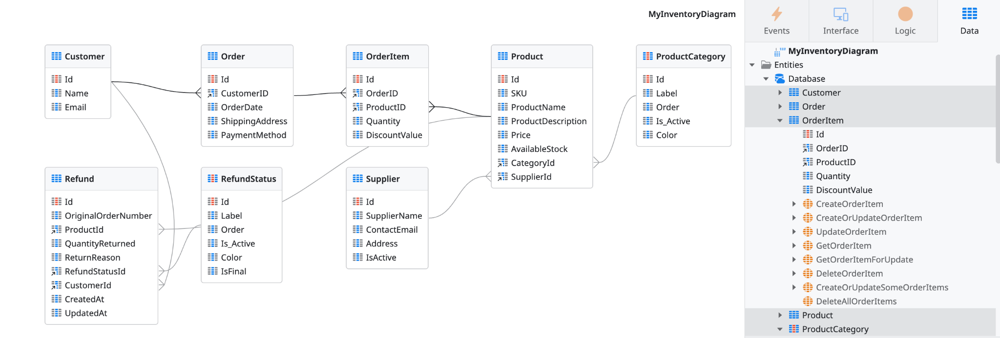

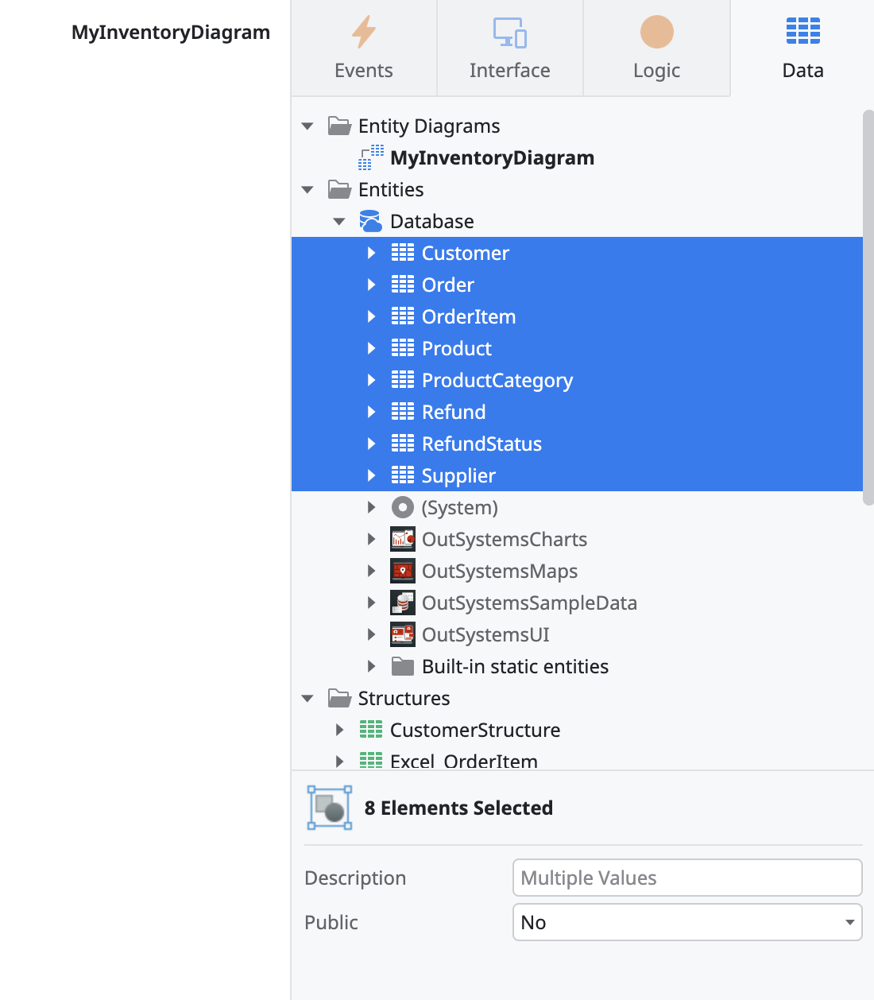

> ✅ **Checkpoint**: You should see lines connecting Order→Customer, OrderItem→Order, OrderItem→Product, etc.

---

## Step 7: Make Entities Public

1. Go to the **"Data"** tab
2. Under Database, select **all entities** (use Shift key)
3. Mark them as **Public = 'Yes'**

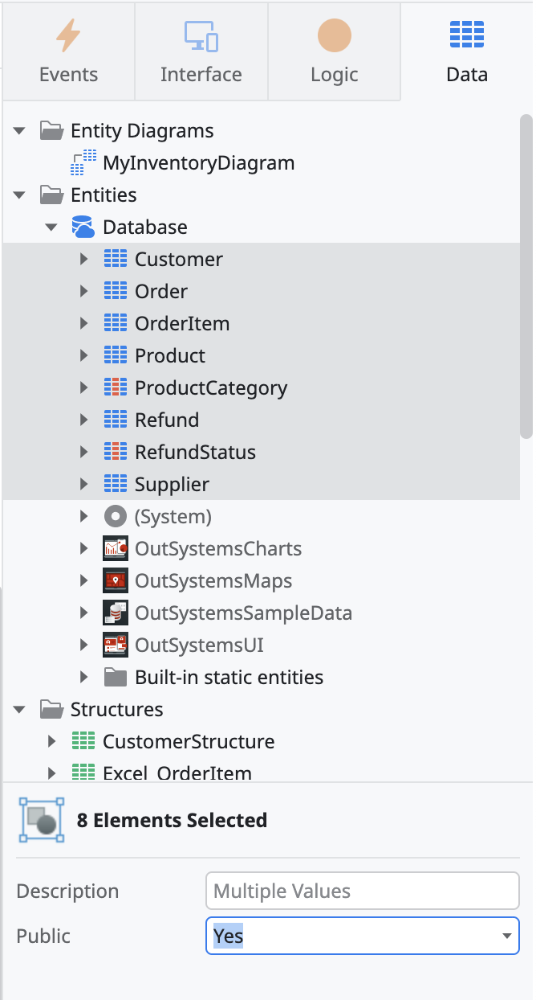

> ⚠️ **Warning**: You'll need the entities as public to use them in the next workshop while building the AI Agent.

---

## Step 8: Publish Your App

Click the **1-Click Publish** button to publish a new version of your app.

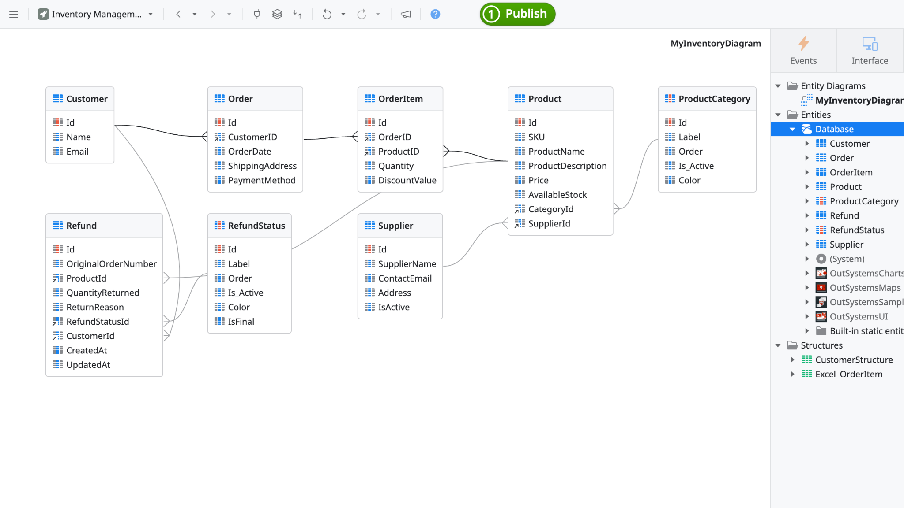

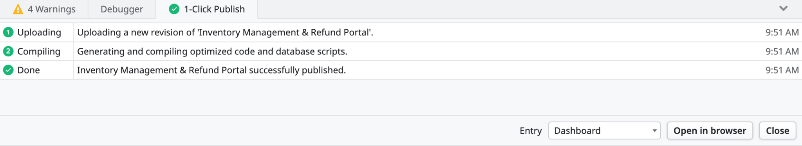

> ℹ️ **Info**: During this process, the platform uploads your model definition, generates standard .NET Core, React, HTML, CSS, and SQL code, optimizes it, compiles it, and publishes it to the cloud.

---

## Step 9: Create Order Screens with Mentor in Studio

1. Open **Mentor** (right upper corner of ODC Studio)
2. Type: **"Create Order List and Order Detail Screens. Add Order List to Menu"**
3. Press **Enter**
4. Mentor will plan the task and may ask for confirmation — **Review and Confirm**

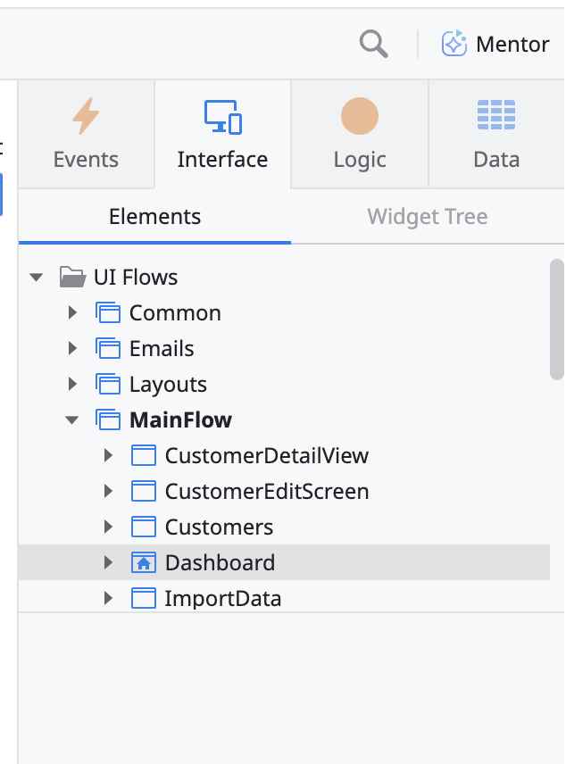

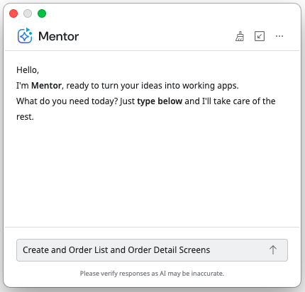

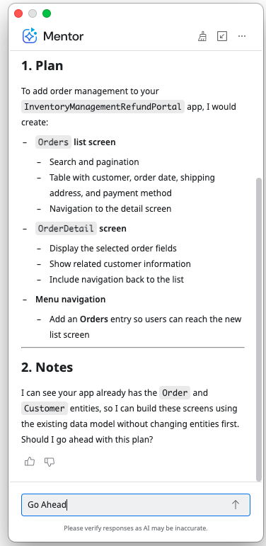

> 💡 **Tip**: Mentor combines the speed of AI with the precision of visual development. It functions as an AI-powered pair programmer within the IDE, allowing developers to execute real-time changes throughout the development lifecycle.

---

## Step 10: Add the "Add Order" Feature

1. Open **Mentor** and type: **"Create the 'Add Order' feature. User should be able to create orders from the orders list screen."**
2. Mentor will plan and ask for confirmation — **Review and Confirm**

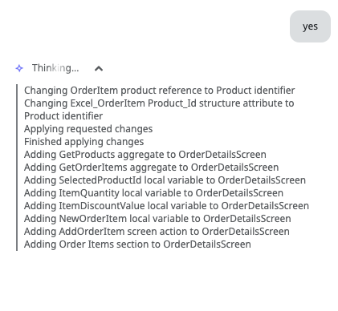

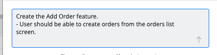

> 💡 **Tip**: You can expand the "Thinking" section to view what actions Mentor is performing.

---

## Step 11: Add Order Items Capability

1. Open **Mentor** and type:
   > "Add the capability to add order items to the order on the Order Details Screen. To add order items user should be able to select the product, quantity and discount value. Adding order items should be shown in a popup"
2. Mentor will plan and ask for confirmation — **Review and Confirm**
3. When completed, you should be able to add order items to orders
4. Click **1-Click Publish** to publish the app

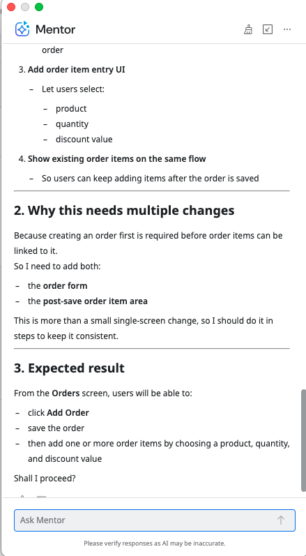

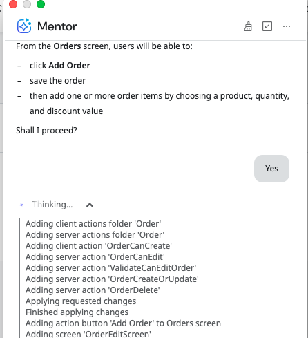

---

## Step 12: Test Your Application

1. Open your app in the browser
2. Navigate to the **"Orders"** screen
3. Open an existing order by clicking on a customer's name
4. Try creating a new order using the **Add Order** button

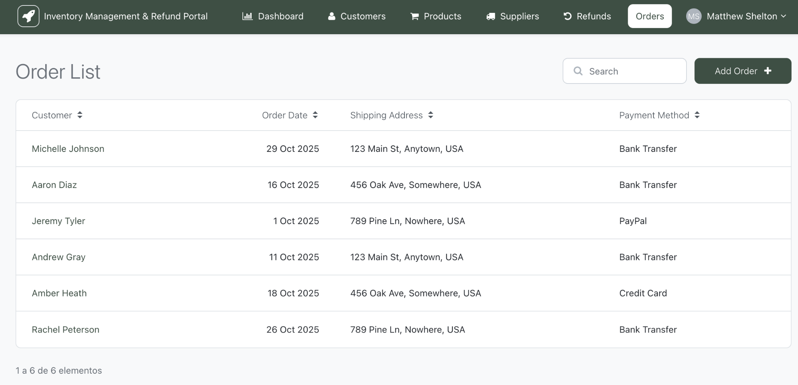

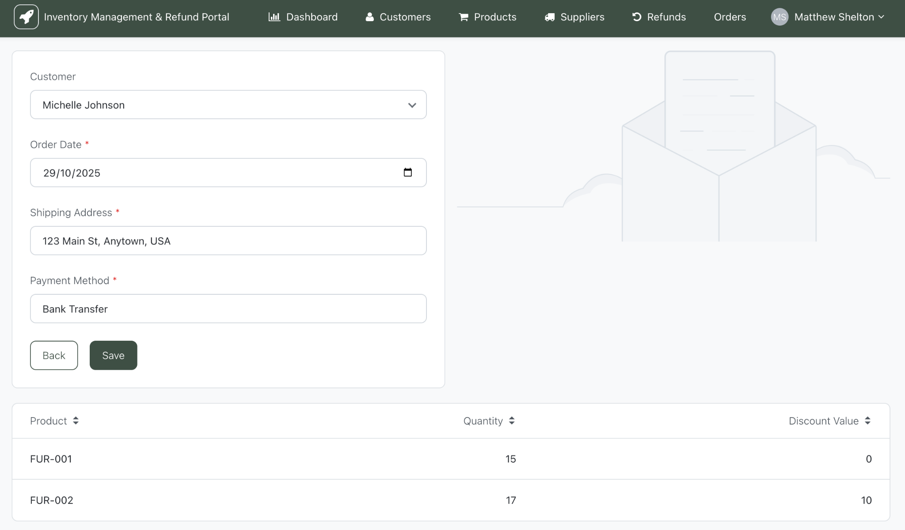

> ✅ **Checkpoint**: You should be able to view orders, create new ones, and add order items via a popup.

---

## Step 13: Verify in Mentor App Editor

1. Go back to your browser where you have your app opened in **Mentor**
2. Refresh the page
3. You should now see:
   - New **Orders** and **Order Items** entities under Data
   - New **Orders** and **Order Details** screens

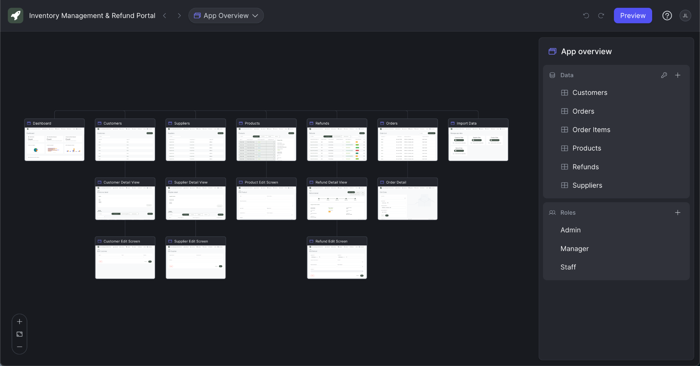

> ℹ️ **Info**: Mentor and ODC Studio work side by side with bidirectional communication. Changes made in one tool are reflected in the other, enabling collaborative refinement using either Mentor's guided experience or ODC Studio's full visual development capabilities.

---

## Summary

You've successfully extended your GenAI-generated app by:

- Creating new entities (Orders, OrderItems) from Excel files
- Establishing foreign key relationships between entities
- Validating your data model with entity diagrams
- Using Mentor in Studio to generate complete screens via natural language prompts
- Publishing and testing the full application

## Next Steps

- Continue to <a href="/workshops/jumpstart-3-build-refund-agent/" target="_blank">JumpStart 3: Build a Refund Agent</a> to add AI intelligence to your app
