## Overview

The operations team wants a quick way to view refund history for specific suppliers along with reasons behind each refund. In this workshop, you'll build an AI-powered agent that combines LLMs with your organization's data to provide context-aware responses about supplier refunds.

## What You'll Learn

- How to create a new Agentic app in ODC Studio
- How to configure grounding data from your application's database
- How to serialize and pass data to an LLM
- How to write effective agent instructions (system prompts)
- How to customize user messages for context-aware responses

## Prerequisites

- Complete [JumpStart 2: Create and Bootstrap Orders](/workshops/jumpstart-2-bootstrap-orders/)
- All entities must be marked as **Public = Yes**

---

## Step 1: Create a New Agentic App

1. Go back to **ODC Studio Dashboard** (click on the first tab)
2. Click the **Create** button
3. Select **Agentic app** from the list

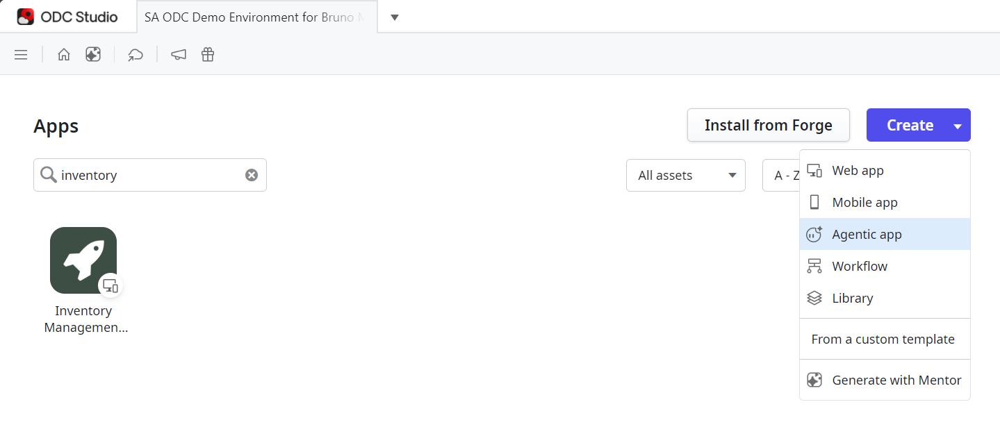

---

## Step 2: Customize Your Agent

1. Click **"Upload image"** and select **RefundAgent.png** from the resources folder
2. Name the agent: **"Refund Agent"**
3. (Optional) Add a description, e.g.: "An agent that specializes in analyzing refund metrics"
4. Click **Continue**
5. Select **TrialClaudeHaiku4_5** as the AI model
6. Click **Create Agentic app**

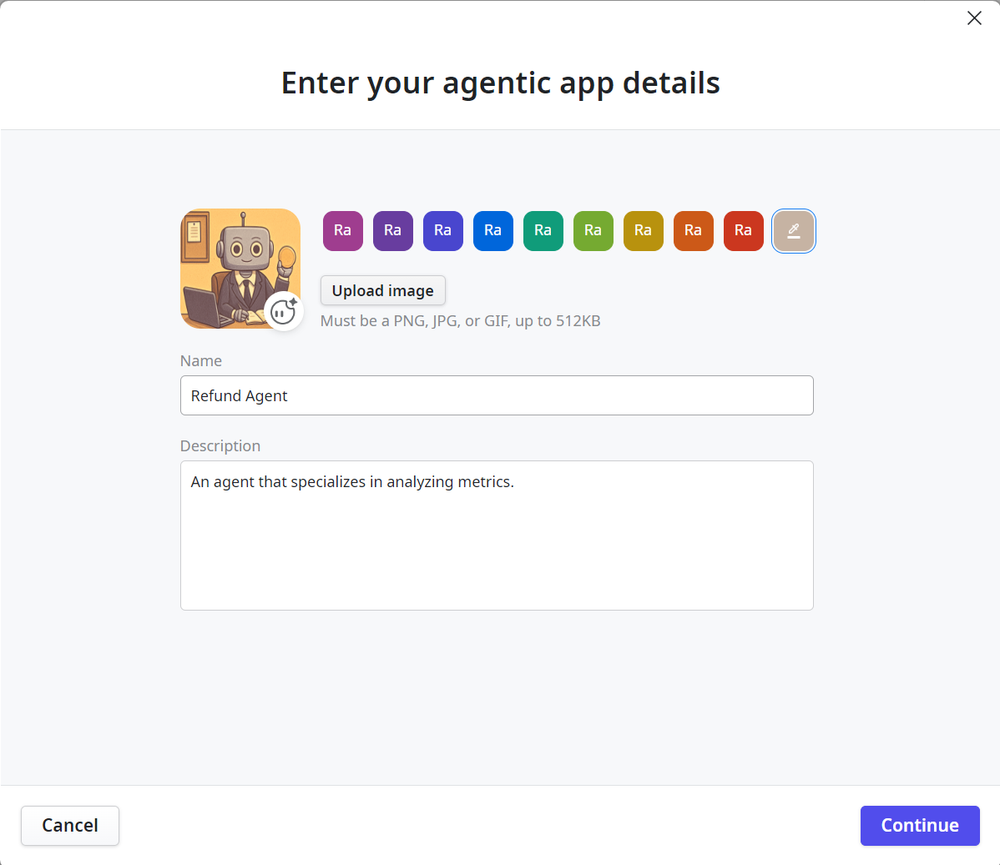

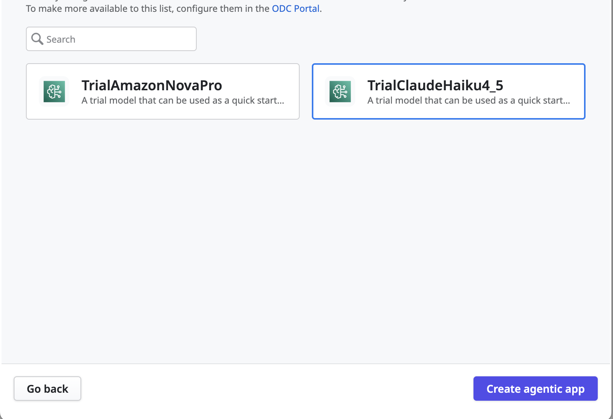

> 💡 **Tip**: By default, you can use trial AI models from leading providers like OpenAI, Amazon, or Anthropic. You can also connect to your own LLMs.

---

## Step 3: Add Your Application Data as Dependencies

1. Open the **Manage Dependencies** menu
2. Filter the **Sources** dropdown by "Inventory" and select your app (Inventory Management & Refund Portal)
3. Select **all entities** from the menu
4. Click **Add**

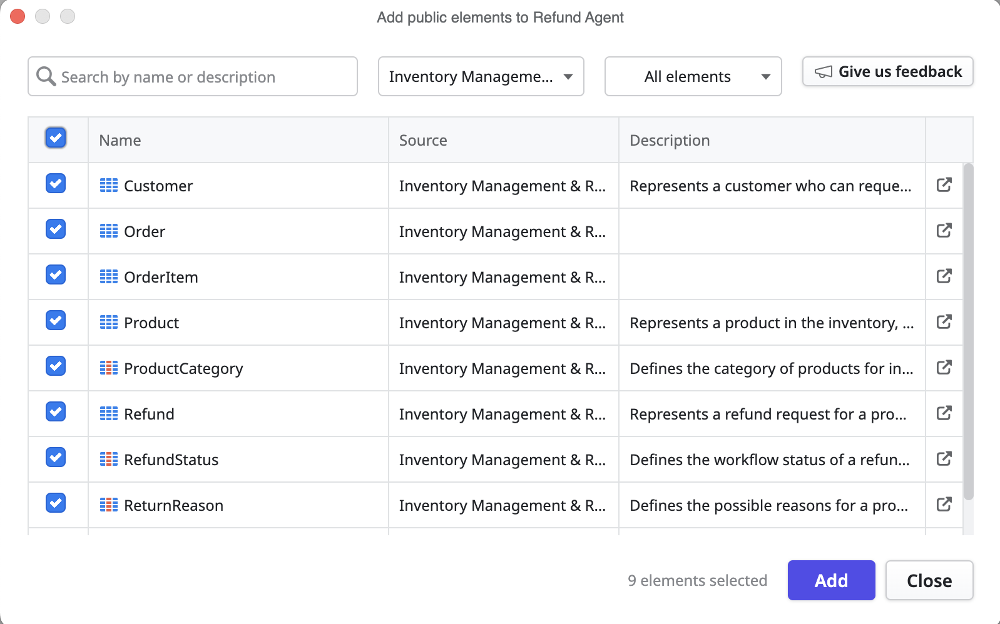

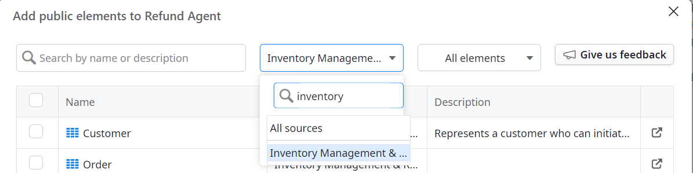

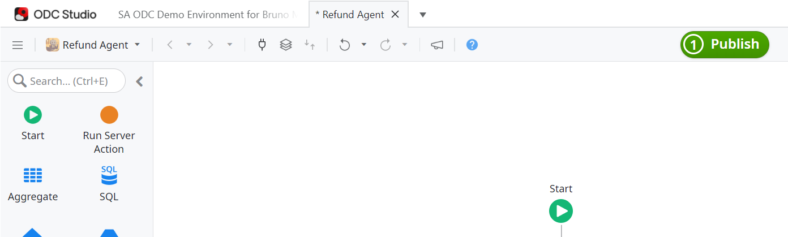


> ℹ️ **Info**: In OutSystems, you can reuse database entities that are marked as Public. By adding them as dependencies, you can use the same data from your main app in the agent.

---

## Step 4: Explore the Agent Logic Flow

1. Ensure you are in the **"Logic"** tab
2. Double-click on the **AgentFlow** action

You should see the following pre-built logic:

| Action | Purpose |
|--------|---------|
| **GetGroundingData** | Add external or internal data sources for business context |
| **BuildMessages** | Set specific instructions and user input for the agent |
| **CallTrialClaudeHaiku4_5** | Trigger the LLM with grounding data and messages |
| **StoreMemory** | Store all messages/interactions after each execution |

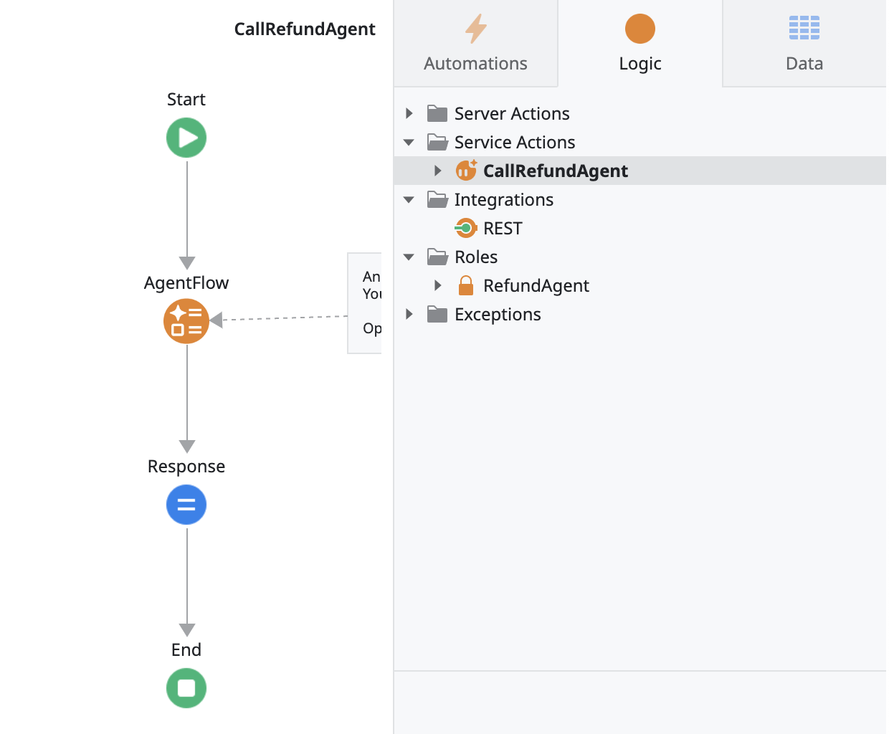

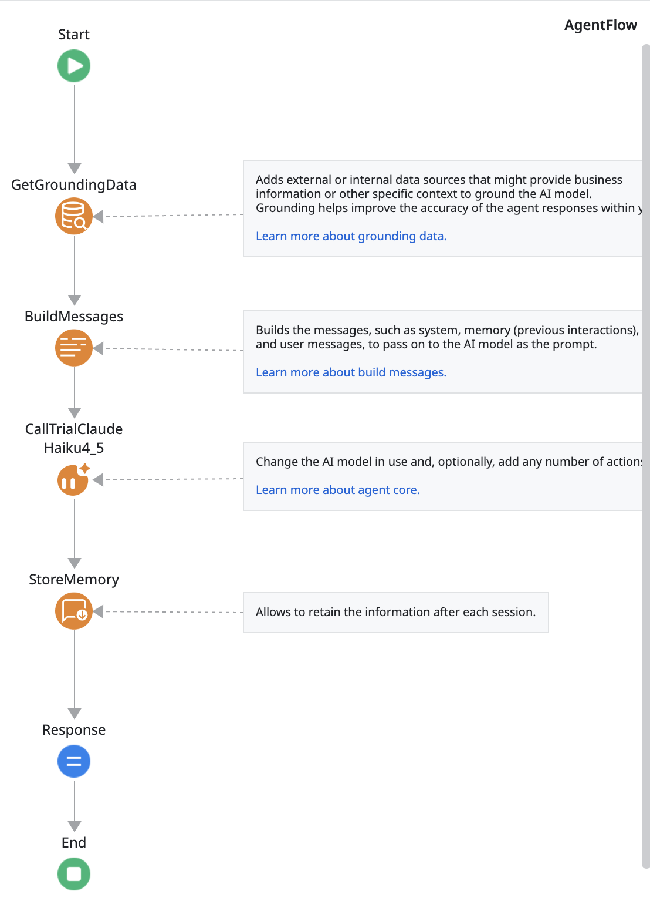

> ℹ️ **Info**: All these pre-built actions are fully customizable and automatically created by default to help you build and tailor each agent.

---

## Step 5: Configure Grounding Data

1. Double-click on the **GetGroundingData** action to open its flow
2. Open the **"Data"** tab
3. Under Database, expand **InventoryManagementRefundPortal**
4. Drag the **Refund** entity to the logic flow
5. Double-click the newly created **GetRefunds** aggregate

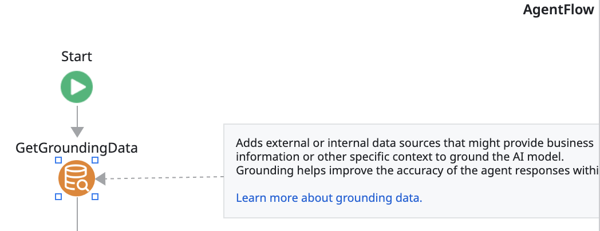

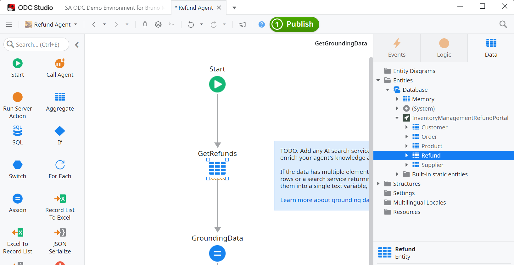

---

## Step 6: Add Data Sources to the Aggregate

1. Click **Add Source**
2. Select the **Product** entity → Click **Select**
3. Repeat for the **Supplier** entity

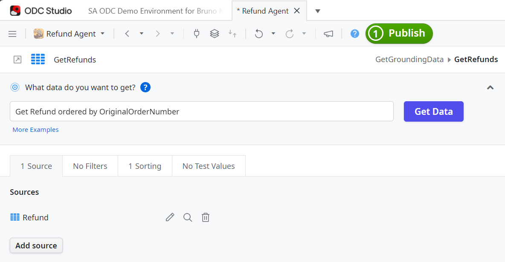

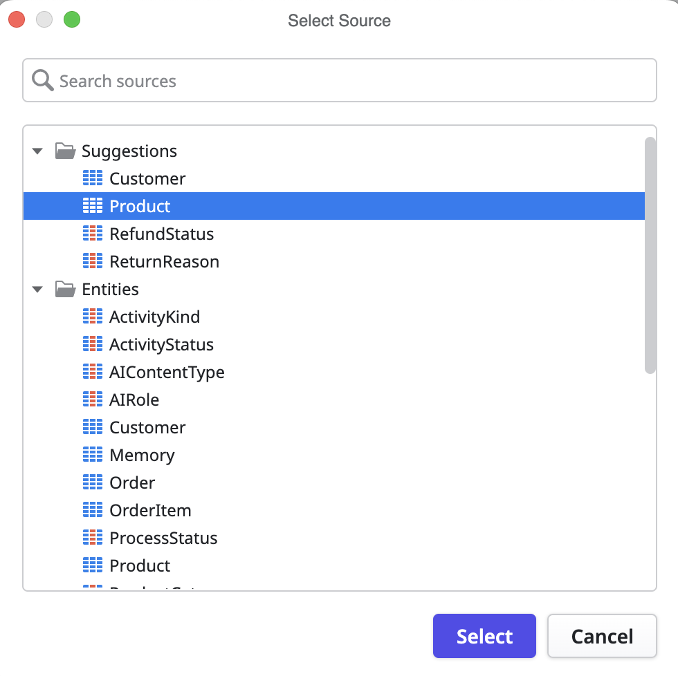

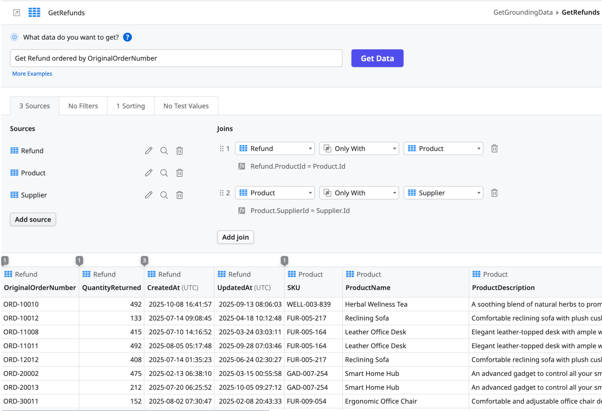

> ℹ️ **Info**: An aggregate is a visual representation of a query to get information from the database. By joining Refund with Product and Supplier, the agent gets complete context.

---

## Step 7: Serialize Data to JSON

1. Go back to the **"Logic"** tab
2. Under Server Actions, double-click **GetGroundingData**
3. From the widget panel on the left, drag **JSON Serialize** and place it between the GetRefunds aggregate and the GroundingData assign action
4. Click the **Data** dropdown and select **GetRefunds.List**

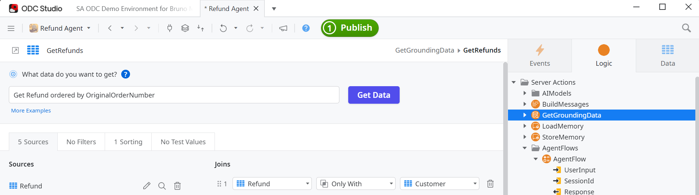

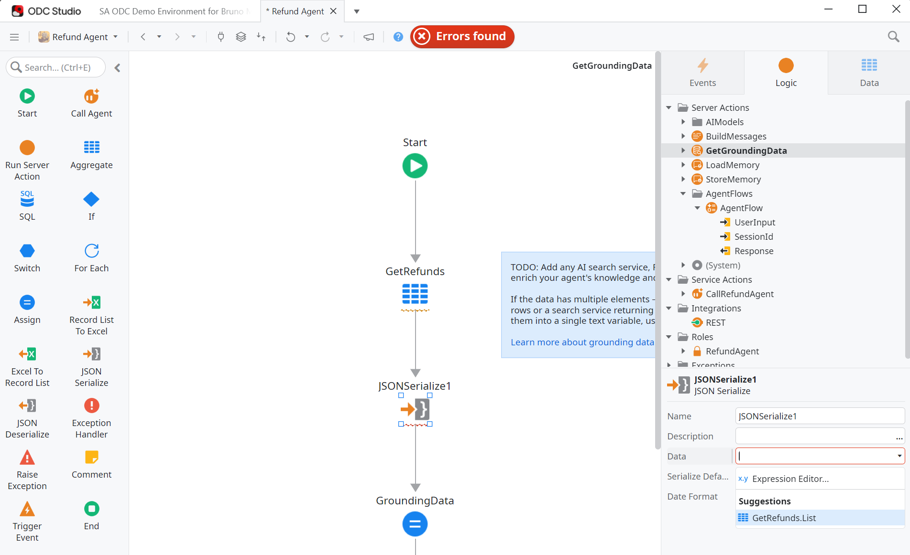

---

## Step 8: Assign Serialized Data as Grounding Data

1. Click on the **GroundingData** assign action
2. Select the value dropdown for the GroundingData variable
3. Select **JSONSerialize.JSON** from the suggestions

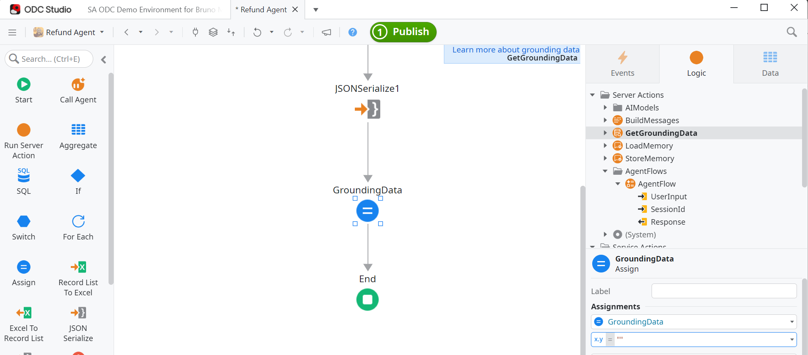

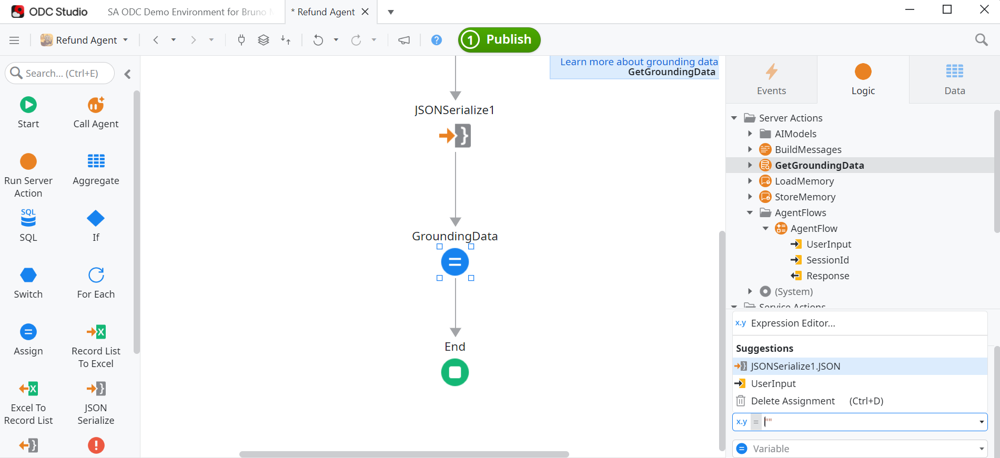

> ✅ **Checkpoint**: Your GetGroundingData flow should now be: GetRefunds (aggregate) → JSON Serialize → Assign GroundingData = JSONSerialize.JSON

---

## Step 9: Write the Agent Instructions

1. Go to the **"Logic"** tab
2. Navigate and double-click on the **BuildMessages** action
3. Click on the **SystemMessage** assign
4. Find the text "You are a helpful assistant" and double-click the **x.y** symbol to open the expression editor
5. Replace with the following text:

```text
You are a helpful assistant who is responsible for making the analysis of refunds based on supplier's name. Your job is to analyze the supplier's information and provide detailed information on the associated refunds.

If there's no refunds for the supplier state ONLY:
There are no refunds for the current supplier

OTHERWISE:
You should reply only with the following information:
Supplier
- SupplierName
Refund Analysis
- Total Refunds
Summary: The summary of the refund information
Associated Products
- ProductName
- Category
- CostPrice
- Selling Price
Refund Details
- Refund ID
- Original Order Number
- Product Name
- Quantity Returned
- Return Reason
- Refund Status
```

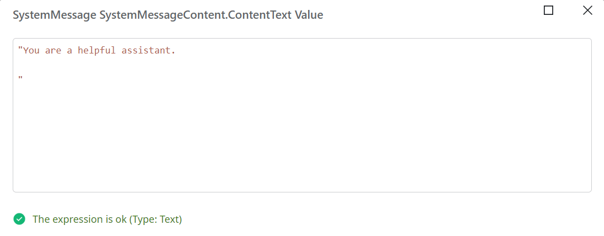

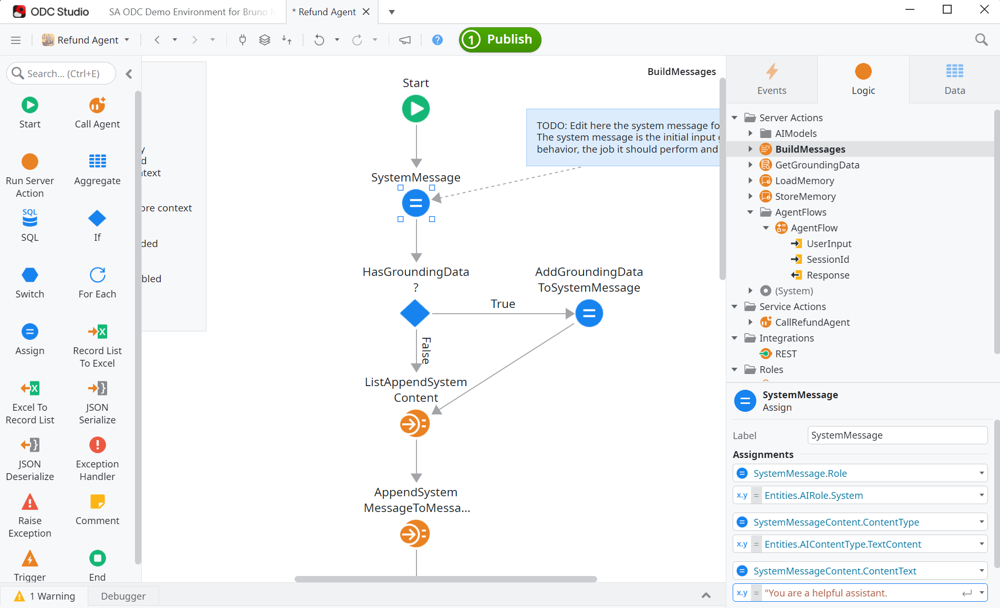

> 💡 **Tip**: Clear, structured instructions help the LLM produce consistent, predictable output. Defining the exact response format ensures the agent's replies are useful for the operations team.

---

## Step 10: Configure the User Message

1. Still in the **BuildMessages** flow, scroll down to find the **"UserMessage"** assign action
2. Double-click on the UserMessage assign
3. Under **UserMessageContent.ContentText**, find "UserInput" and double-click the **x.y** symbol
4. Change the expression to:

```text
"Here is the Supplier's name:" + UserInput
```

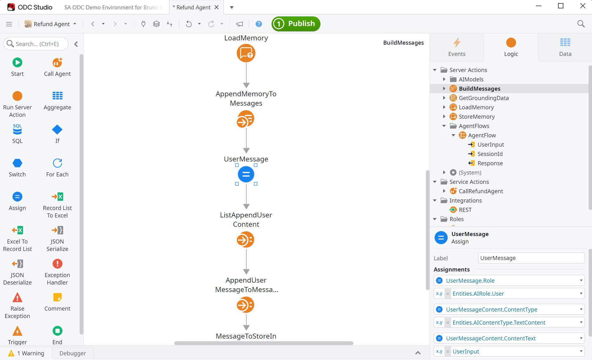

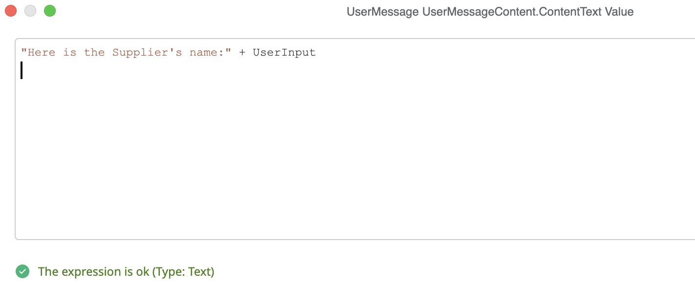

---

## Step 11: Increase Agent Timeout and Publish

1. On the top left corner, select **Refund Agent** (dropdown → Edit app properties)
2. Select the **Properties** tab
3. Change the **Default Timeout** value to **60**
4. Click **Close**
5. Click **1-Click Publish** to publish your agent

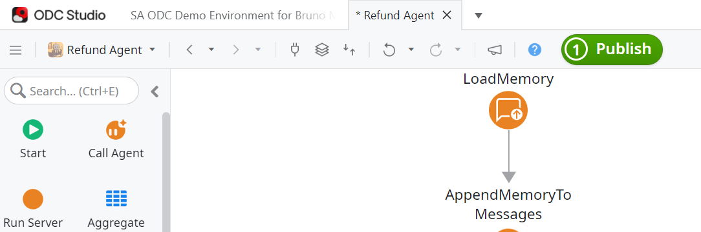

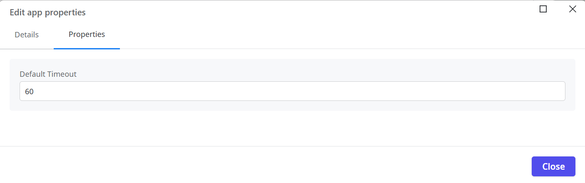

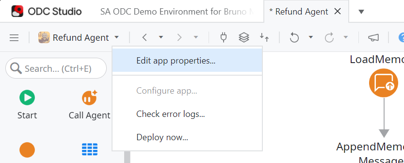

---

## Summary

You've built an AI-powered Refund Agent that:

- Connects to your application's live database (Refund, Product, Supplier data)
- Serializes and passes grounding data to an LLM
- Uses structured system instructions to produce consistent analysis
- Accepts a supplier name as input and returns detailed refund analysis

## Next Steps

- Continue to [JumpStart 4: Embed the Agent in Your App](/workshops/jumpstart-4-embed-agent-in-app/) to integrate this agent into your web application's UI
