## Overview

In this bonus workshop, you'll extend your Refund Agent with **tools** — server-side actions that the LLM can autonomously decide to call. You'll create a USD-to-EUR currency converter and observe how the agent uses it to enhance its refund analysis with multi-currency values.

## What You'll Learn

- How to create tools (server actions) for agents
- How tool descriptions help the LLM decide when to use them
- How to add tools to an agent's execution flow
- How AI-inferred parameters work
- How to observe tool execution in monitoring traces

## Prerequisites

- Complete [JumpStart 4: Embed the Agent in Your App](/workshops/jumpstart-4-embed-agent-in-app/)

---

## Step 1: Create a Server Action for the Tool

1. Go back to the **"Refund Agent"** app in ODC Studio
2. Click on the **Logic** tab
3. Right-click on **Server Actions** → select **"Add Server Action"**
4. Name it: **"ToolConvertToEUR"**
5. Set the description to:

```text
This tool converts a decimal value that represents a number in USD currency to EUR currency
```

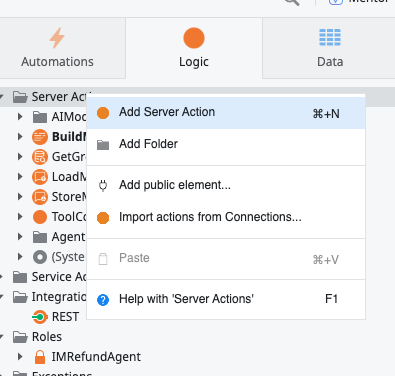

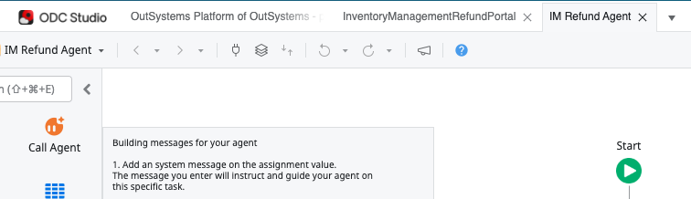

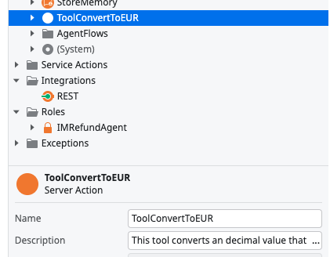

> ℹ️ **Info**: The description is critical — it tells the LLM what this tool does and helps it decide when to invoke it.

---

## Step 2: Add Input and Output Parameters

**Input Parameter:**
1. Right-click on **ToolConvertToEUR** → select **"Add Input Parameter"**
2. Name: **AmountInUSD**
3. Description: `Amount in USD currency`
4. Data Type: **Decimal**

**Output Parameter:**
5. Right-click on **ToolConvertToEUR** → select **"Add Output Parameter"**
6. Name: **AmountInEUR**
7. Description: `The converted amount in EUR currency`
8. Data Type: **Decimal**

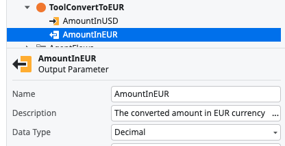

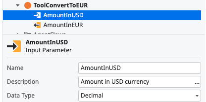

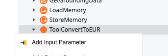

---

## Step 3: Add the Conversion Logic

1. Double-click on **ToolConvertToEUR** to open its flow
2. Drag an **Assign** from the left pane
3. Set Variable: **AmountInEUR**
4. Set Value: `AmountInUSD * 1.2`

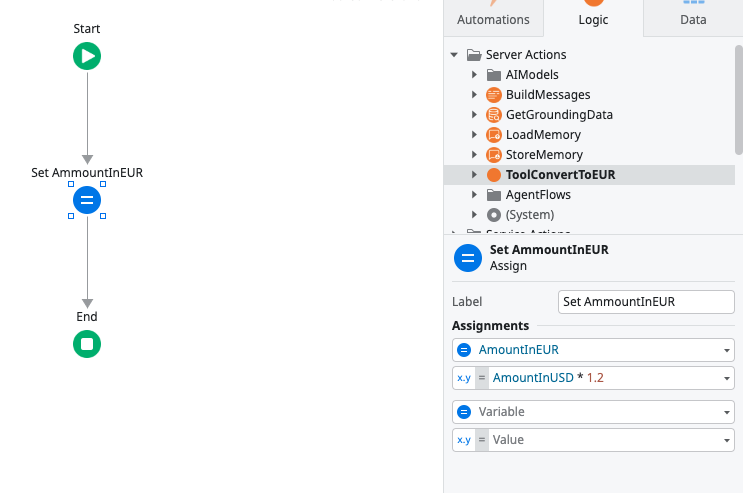

> 💡 **Tip**: For this exercise, we use a fixed 1.2x conversion rate. In production, you have full flexibility to call web services, query databases, or orchestrate calls to other agents within a tool action.

---

## Step 4: Add the Tool to the Agent Flow

1. Go back to the agent flow: **Logic → AgentFlows → double-click AgentFlow**
2. Double-click on **CallTrialClaudeHaiku4_5**
3. Click **Add Action**
4. Select **ToolConvertToEUR**

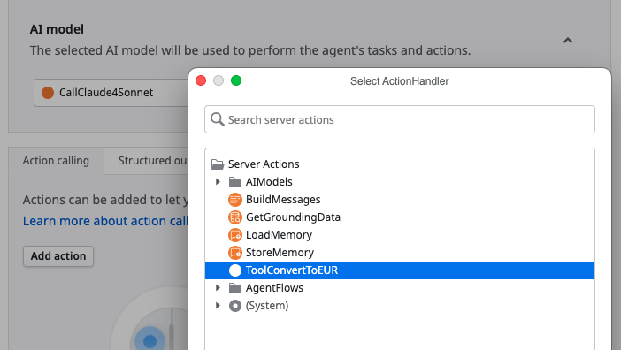

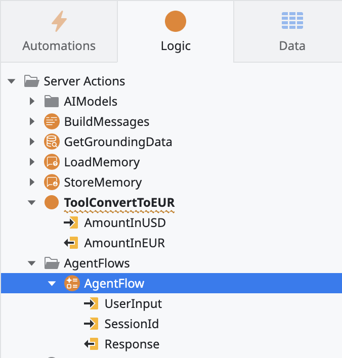

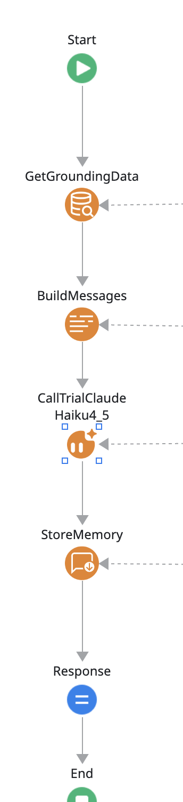

---

## Step 5: Review Tool Parameters

Note that descriptions for tools and parameters are prefilled based on your previous inputs.

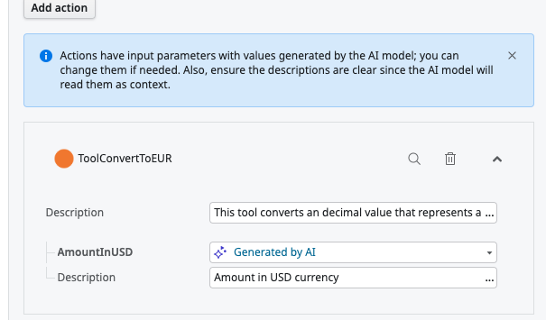

**Key architectural points:**

| Concept | Description |
|---------|-------------|
| **Multi-Tool Capability** | Agents can have multiple tools for complex requirements |
| **Autonomous Orchestration** | The LLM independently decides which tools to use |
| **AI-Inferred Parameters** | Parameters flagged as "Generated By AI" are auto-populated by the LLM |
| **Security & Guardrails** | Developers can "lock" parameters at design time to prevent spoofing |

> ⚠️ **Warning**: User identity should be handled by application logic, not LLM inference, to prevent security issues.

---

## Step 6: Update the Agent Prompt

1. Go to the **"Logic"** tab
2. Double-click on **BuildMessages** action
3. Click on the **SystemMessage** assign
4. **Append** the following to the existing system message (don't replace it):

```text
IMPORTANT
All currency values you display should be presented in USD and EUR
```

5. Click **1-Click Publish** to publish the agent

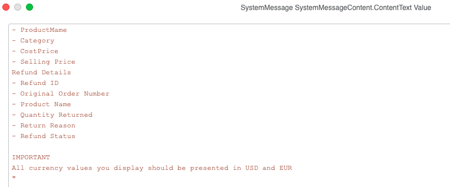

> ⚠️ **Warning**: Make sure you APPEND to the existing message rather than replacing it entirely. The original refund analysis instructions must remain.

---

## Step 7: Test Your Agent with Tools

1. Open your Inventory Management app in the browser
2. Navigate to a Supplier's detail page
3. Click the **Refunds** button
4. Observe that currency values now appear in both USD and EUR

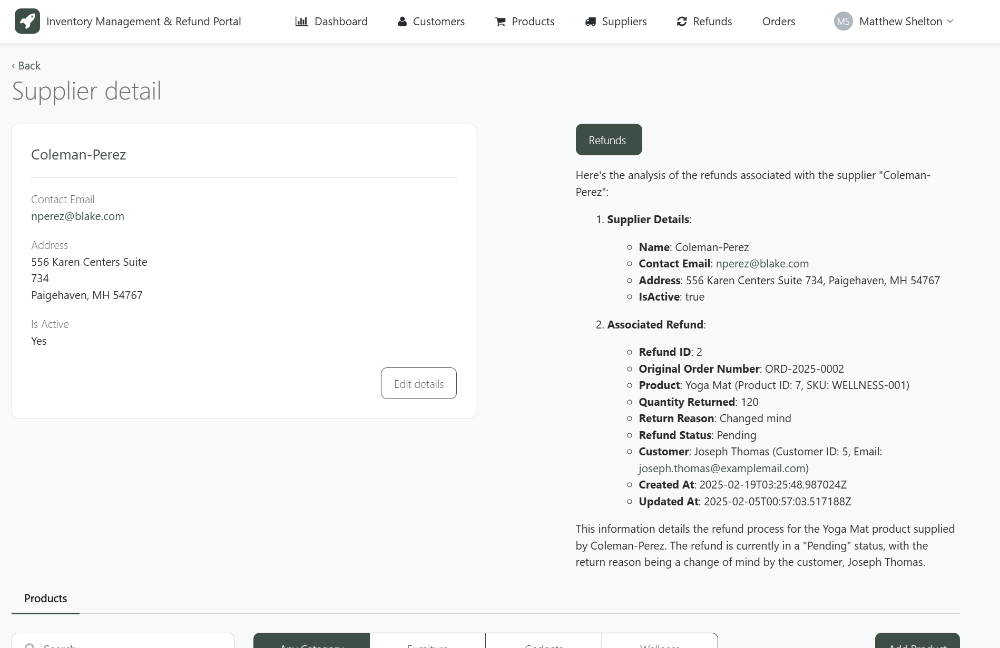

---

## Step 8: Monitor Tool Execution (Optional)

To see the full execution trace:

1. Go to **ODC Portal** → **Monitoring** → **Traces**
2. Find the recent agent call trace
3. Observe the iterative loop where the LLM invokes the currency conversion tool

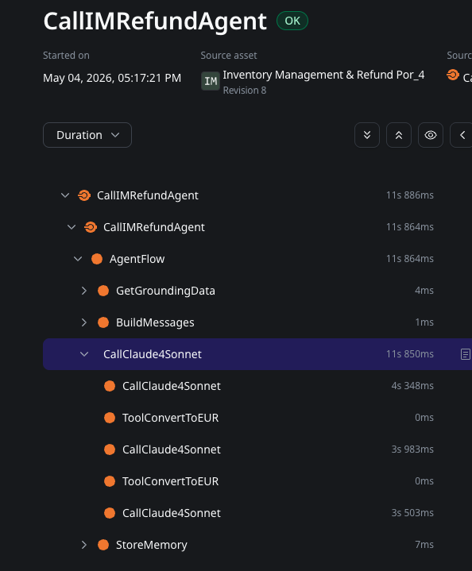

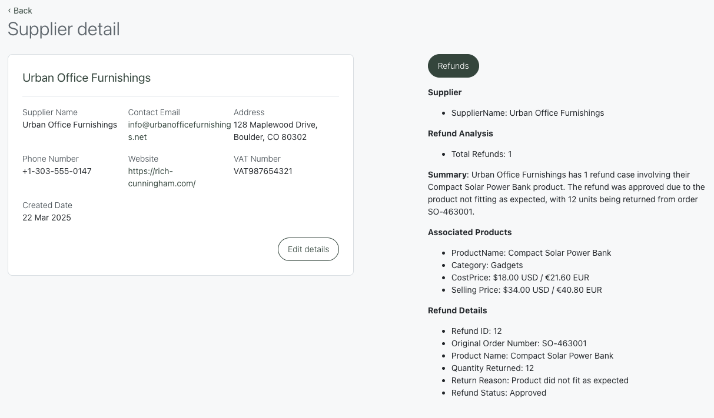

> 💡 **Tip**: The trace shows how the LLM autonomously decided to call the conversion tool for each currency value, demonstrating the agent's autonomous orchestration capability.

---

## Summary

Congratulations! 🎉 You've completed the full JumpStart workshop series. In this bonus section, you:

- Created a tool (server action) with proper descriptions for LLM understanding
- Added input/output parameters with AI-inferred values
- Connected the tool to your agent's execution flow
- Updated the system prompt to trigger tool usage
- Observed autonomous tool invocation in monitoring traces

## What You've Built Across All Workshops

| Workshop | What You Built |
|----------|---------------|
| **JumpStart 1** | Full-stack web app from requirements document using GenAI |
| **JumpStart 2** | Extended app with new entities, relationships, and screens |
| **JumpStart 3** | AI-powered Refund Agent with grounding data |
| **JumpStart 4** | Agent embedded in the app UI with Markdown rendering |
| **JumpStart 5** | Agent enhanced with autonomous tool-calling |

**In minutes, not months, your GenAI-powered web app with intelligent agents is ready to go!**
