Excited to see you at the upcoming OutSystems JumpStart Workshops! If this is your first time, congratulations on taking the first step. If you're returning for this workshop, glad to see you again!

This page describes all the steps required to get started, including some optional requirements for more advanced workshops. To make it easier for you, we've organized the content by requirement type, which you can navigate using the sidebar.

We'd appreciate it if you could prepare everything listed below before the event so we can make the most of our time together.

## Workshop Requirement 1: General JumpStart Workshops

These requirements are mandatory for any JumpStart Workshop, as they help you set up the foundation. Complete these two steps (approx. 30 minutes):

### Step 1: Create Your Personal OutSystems Environment

Sign up for free at [OutSystems Platform Signup](https://www.outsystems.com/Platform/Signup?uc=startfree).
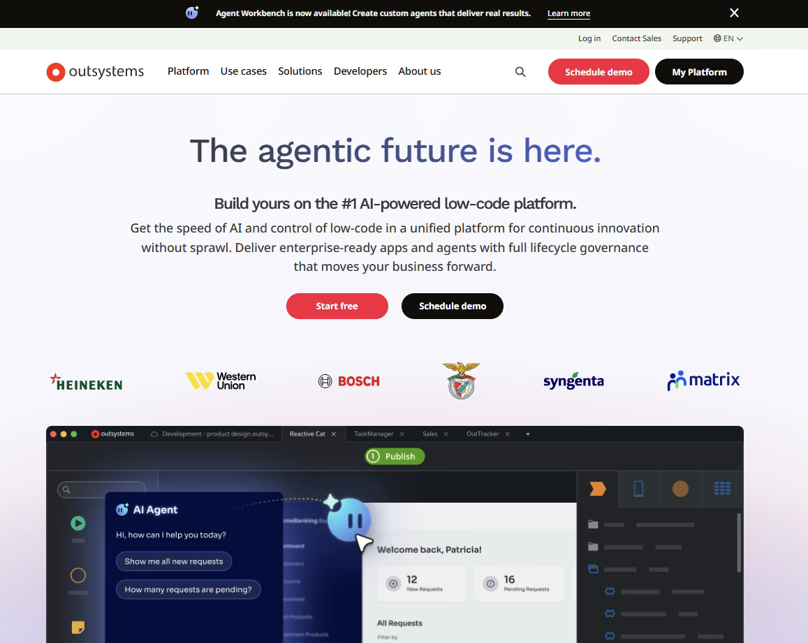

### Step 2: Complete the Form

1. Fill out the form with your information
2. Click on Agree and start free

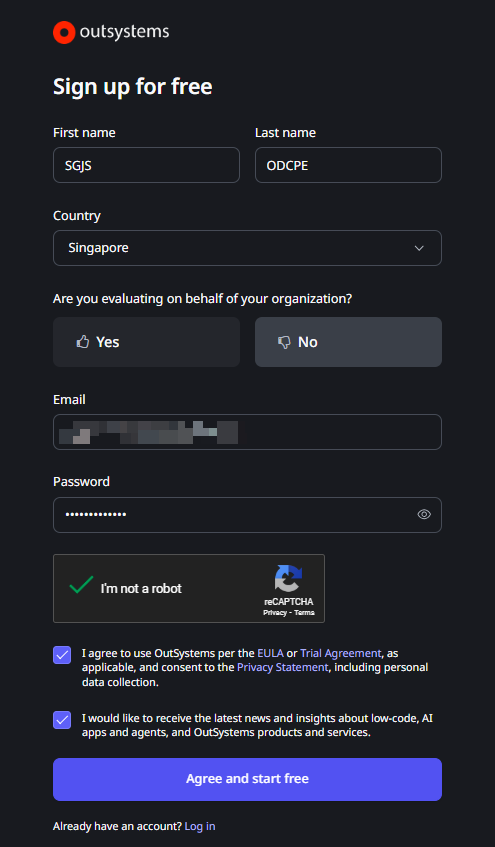

### Step 3: Receive activation email from OutSystems

1. Check your email
2. Click on the Activate account button in the activation email from OutSystems

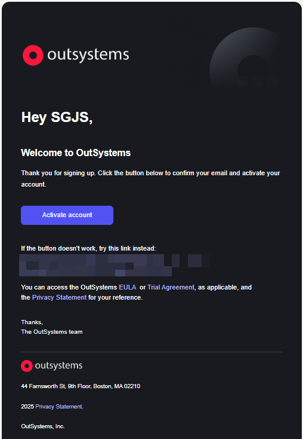

### Step 4: Login to OutSystems

1. Enter your password (set in Step 2)
2. Click on Log In

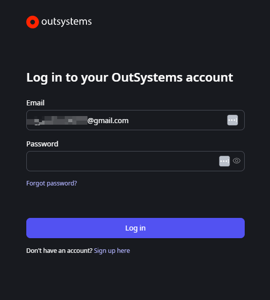

### Step 5: Request ODC Personal Edition

In our website with your newly created account, click on Start building

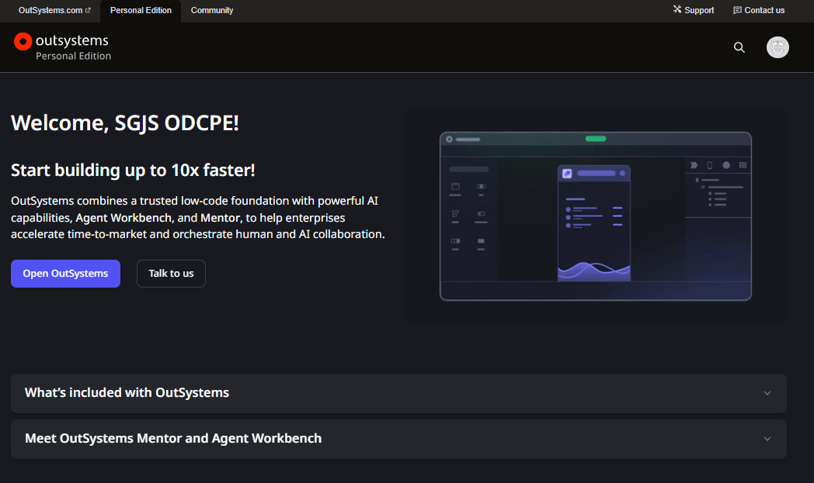

### Step 6: Wait for email notification when your Personal Edition is ready

It might take 1 day to receive the notification that your Personal Edition environment is ready.

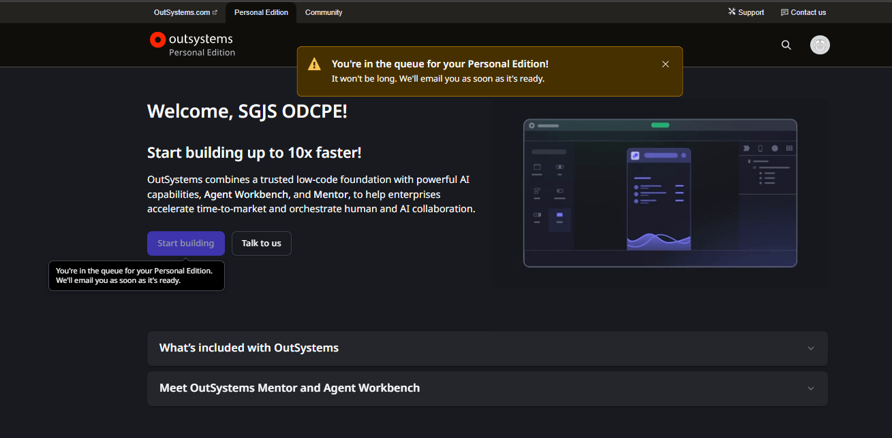

### Step 7: Receive Email Notification  

1. Check again your email for confirmation that your personal edition is ready
2. Click on Go to Personal Edition

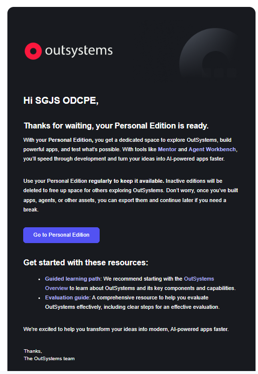

### Step 8: Login to OutSystems Portal

1. Enter your registered Email Address
2. Enter the Password
3. Click on Log in

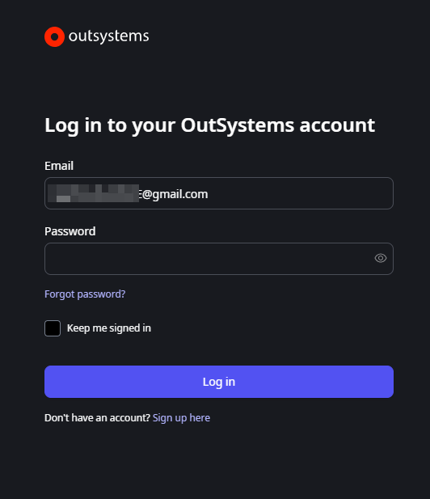

### Step 9: Getting into your new Personal Edition

Click on the Open OutSystems


### Step 10: Login to your Personal Edition environment

1. Enter your registered Email address
2. Enter the Password
3. Click on Log in

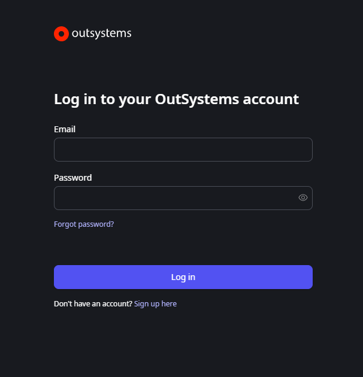

### Step 11: Welcome to ODC Personal Edition Portal

Take note of the URL in your browser (example: https://personal-XXXXX.outsystems.dev/). 

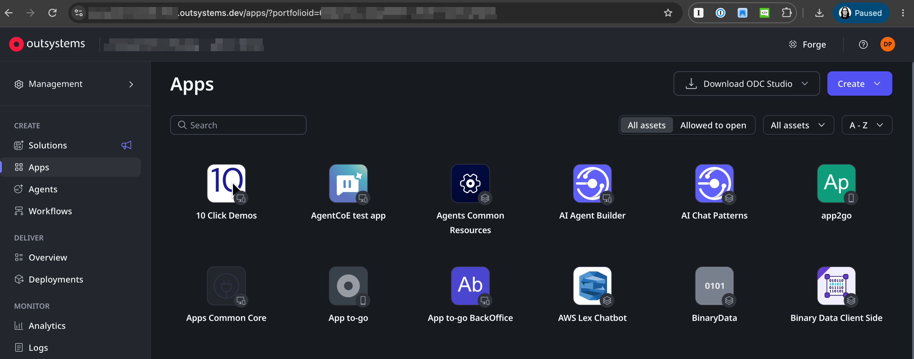

### Step 12: Download ODC Studio

1. In your Portal, click on Download ODC Studio
2. Double-click the executable to install the ODC Studio in your laptop / desktop
3. Wait for a couple of minutes to complete the installation

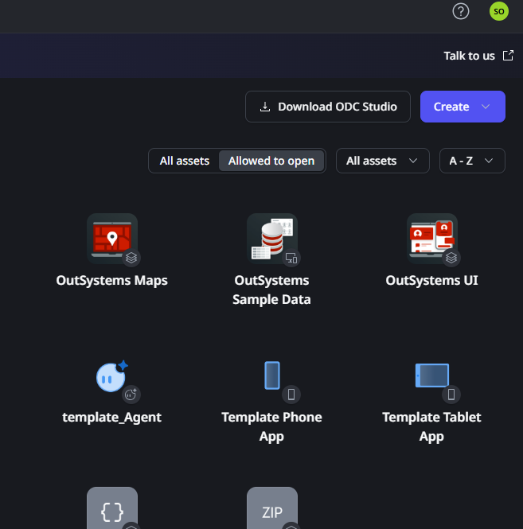

### Step 13: Start ODC Studio

1. Start ODC Studio application in your desktop
2. Enter the URL captured in step 11 (without /apps/)
3. Click on Continue in browser

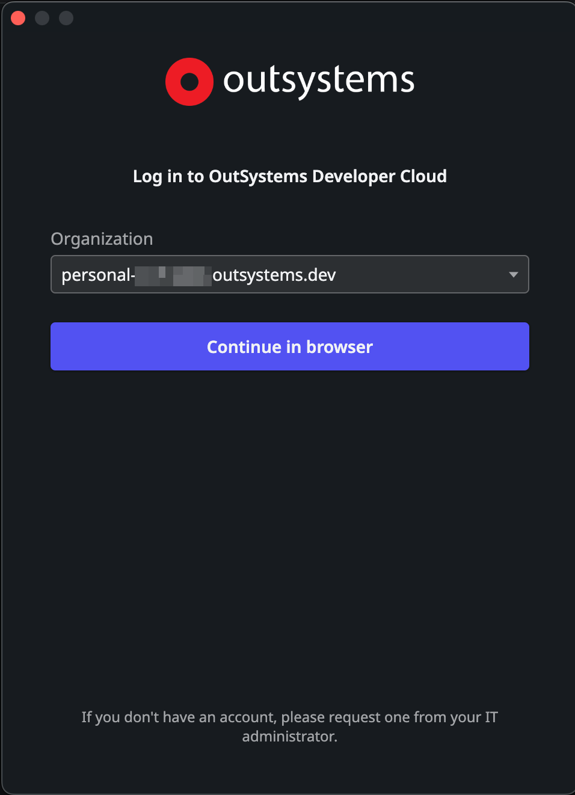

### Step 14: Start ODC Studio

1. Enter your Email and Password
2. Click on Log In

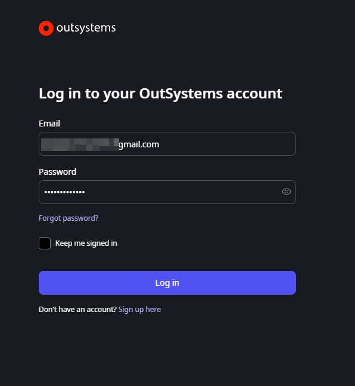


You're done! 🥳

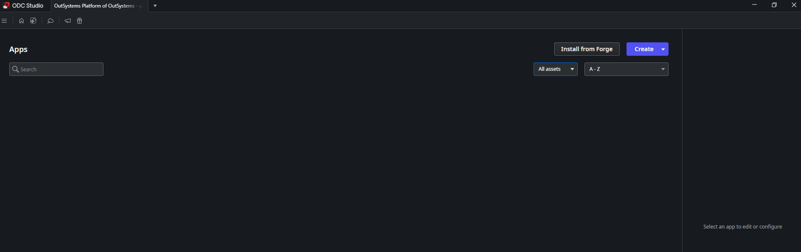

## Workshop Requirement 2: Deep Dive Workshops (Best Practices)

In some workshops, we dive deep into best practices for building applications and AI agents, including architecture. For those sessions, you'll need the **OutSystems Docs MCP** (unofficial), which enables your AI tools to interact with the OutSystems documentation.

You will need:

- [Python](https://www.python.org/downloads/) (3.13 preferred)
- [uv](https://docs.astral.sh/uv/) — Python package and project manager

Install the OutSystems Docs MCP (unofficial):

### Step 1: Clone the Repo

```bash
git clone https://github.com/donnieprakoso/mcp-outsystems-docs.git
```

### Step 2: Install All the Requirements

```bash
uv sync
```

### Step 3: Build the Semantic Index of the OutSystems Documentation (O11 and ODC)

```bash
uv run sync
```

### Step 4: Install the MCP into Your Agent

```bash
claude mcp add outsystems-docs -- uv run --directory /path/to/mcp-outsystems-docs osmcp-serve
```

### Step 5: Try and Test It Out

Send this prompt to your agent:

```text
With OutSystems Docs MCP, what are the best practices for building apps with ODC?
```

## Workshop Requirement 3: Agentic Experience Workshop

If your workshop covers Agentic Experience, you'll need the following tools:

- AI coding agent with MCP support, for example Claude Code, Codex, Kiro, OpenCode, or Pi
- Access to the Agent Experience Early Access Program (EAP)
- Access to your OutSystems tenant

The following example steps use OpenCode, but any MCP-capable agent works the same way.

### Step 1: Get Your OutSystems Tenant URL

Sign in to the [ODC Portal](https://go.outsystems.com). Your tenant URL follows this pattern:

```text
https://<your-tenant>.outsystems.dev
```

### Step 2: Add the OutSystems MCP Configuration

In OpenCode, add the OutSystems MCP server to your `opencode.json` configuration file:

```json
{
  "$schema": "https://opencode.ai/config.json",
  "mcp": {
    "outsystems": {
      "type": "remote",
      "url": "https://<your-tenant>.outsystems.dev/mcp",
      "enabled": true
    }
  }
}
```

Replace `<your-tenant>` with your tenant name from Step 1 — the MCP endpoint is your tenant URL followed by `/mcp`.

For Claude Code, add the same endpoint using:

```bash
claude mcp add --transport http outsystems https://<your-tenant>.outsystems.dev/mcp
```

### Step 3: Authenticate Your OutSystems MCP

The OutSystems MCP is protected by standard OAuth — there are no tokens or API keys to manage manually. Make your first OutSystems request in your agent, and it will prompt you to sign in through your browser. Complete the sign-in, and you're connected.

### Step 4: Test It

Send this prompt to your agent:

```text
List all of my assets in my OutSystems tenancy
```

Your agent should respond with a list of assets from your OutSystems tenant.

## Workshop Requirement 4: AWS Integration

> **Work in progress.** This section is coming soon.
